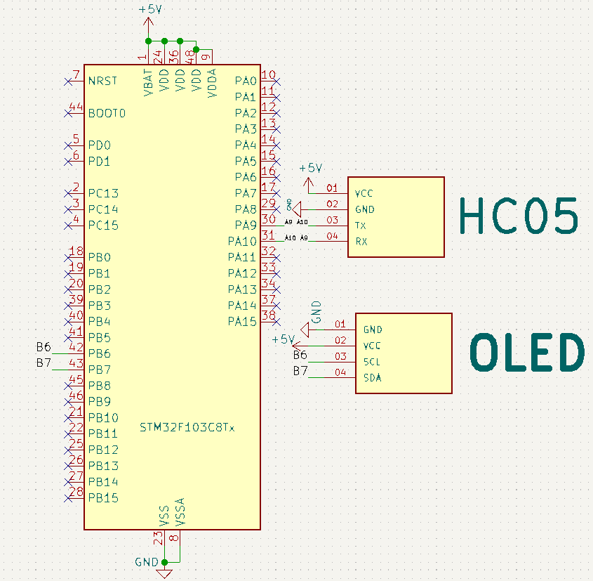

# Day 02 – Wireless Notice Board 📲🖥️

## 🎯 Objective
Display messages sent over Bluetooth from a smartphone onto an OLED display using the STM32 Bluepill board.

---

## 🔧 Components Used
- STM32 Bluepill (STM32F103C8T6)
- 0.96" OLED Display (SSD1306, I2C)
- HC-05 Bluetooth Module
- Android Phone with Serial Bluetooth Terminal app
- Jumper wires and breadboard

---

## 🔌 Circuit Connections

### OLED Display (I2C)
| OLED Pin | STM32 Pin |
|----------|-----------|
| VCC      | 3.3V      |
| GND      | GND       |
| SCL      | PB6       |
| SDA      | PB7       |

### HC-05 Bluetooth Module
| HC-05 Pin | STM32 Pin |
|-----------|-----------|
| VCC       | 5V        |
| GND       | GND       |
| TX        | PA10      |
| RX        | PA9  |

---

## ⚙️ How It Works
1. Connect HC-05 to your smartphone (default password: 1234).
2. Open a Bluetooth terminal app and send a message.
3. The STM32 receives the message via Serial and displays it on the OLED screen.
4. Each message ends with a newline (`\n`) to trigger display.

---

## 🖼️ Demo

---

## 📽️ Video
Coming soon on Instagram: [@jyotirmakes](https://www.instagram.com/jyotirmakes?igsh=dXhyYWc5bWsyMWgw)
