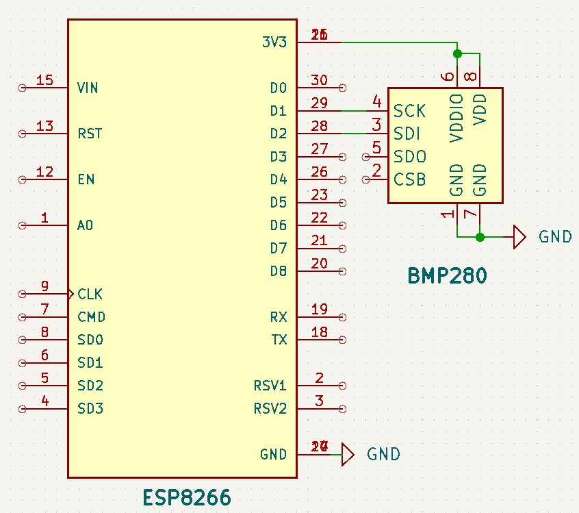

# Day 02 – Wireless Notice Board 📲🖥️

## 🎯 Objective
Making a mini weather station using BMP280 and ESp8266.

---

## 🔧 Components Used
- ESP8266 or 
- BMP280
- Jumper Wires
- Breadboard
---

## 🔌 Circuit Connections

### BMP280 (I2C)
| BMP280 Pin | ESP8266Pin |
|----------|--------------|
| VCC      | 3.3V         |
| GND      | GND          |
| SCL      | D1           |
| SDA      | D2           |

---

## ⚙️ How It Works
1. ESP8266 connected to internet and launch a local IP.
2. Serial monitor print the local IP and as the ESP connectes to internet.
3. The server shows the real time value of pressure and temperature.
4.Data of the server changes each 4 seconds interval.

---

## 🖼️ Demo

---

## 📽️ Video
Coming soon on Instagram: [@jyotirmakes](https://www.instagram.com/jyotirmakes?igsh=dXhyYWc5bWsyMWgw)
