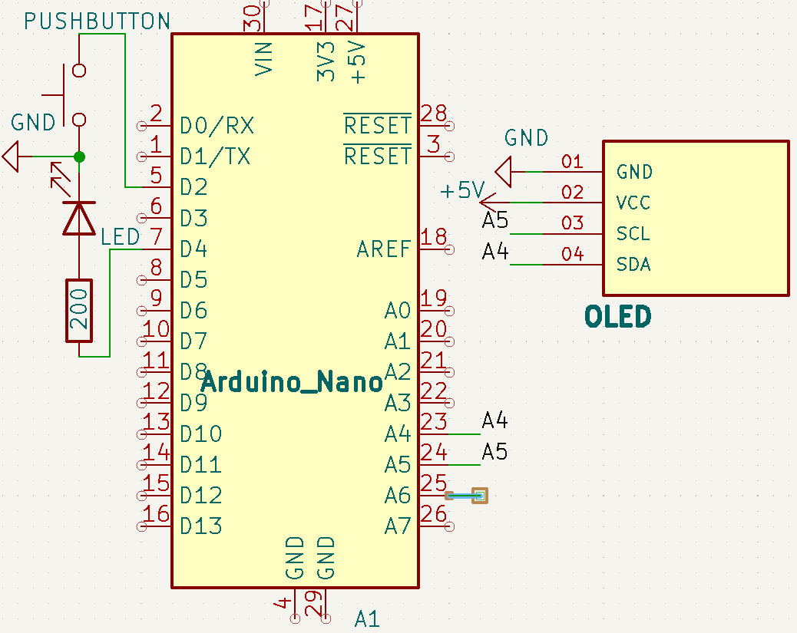

# 🎮 Day 4 – Reaction Timer Game

This project is a simple reaction time tester built using an Arduino Nano, an LED, and a pushbutton.  
The LED lights up after a random delay, and the player must press the button as quickly as possible. The Arduino then displays the reaction time in milliseconds on the Serial Monitor.

---

## 🧠 How It Works

1. Press the button to start the game.
2. Wait for the LED to turn ON after a random delay (2–5 sec).
3. Press the button as fast as possible once the LED lights up.
4. Your reaction time is printed on the Serial Monitor.

---

## 🔌 Circuit Diagram

---

## ⚙️ Components Used

- Arduino Nano
- LED
- Pushbutton
- 220Ω resistor (for LED)
- Breadboard + jumper wires

---

## 📷 Demo

---

## 🧾 Code

See: [`Reaction_Timer.ino`](./Reaction_Timer.ino)

## 📽️ Video
Coming soon on Instagram: [@jyotirmakes](https://www.instagram.com/jyotirmakes?igsh=dXhyYWc5bWsyMWgw)
