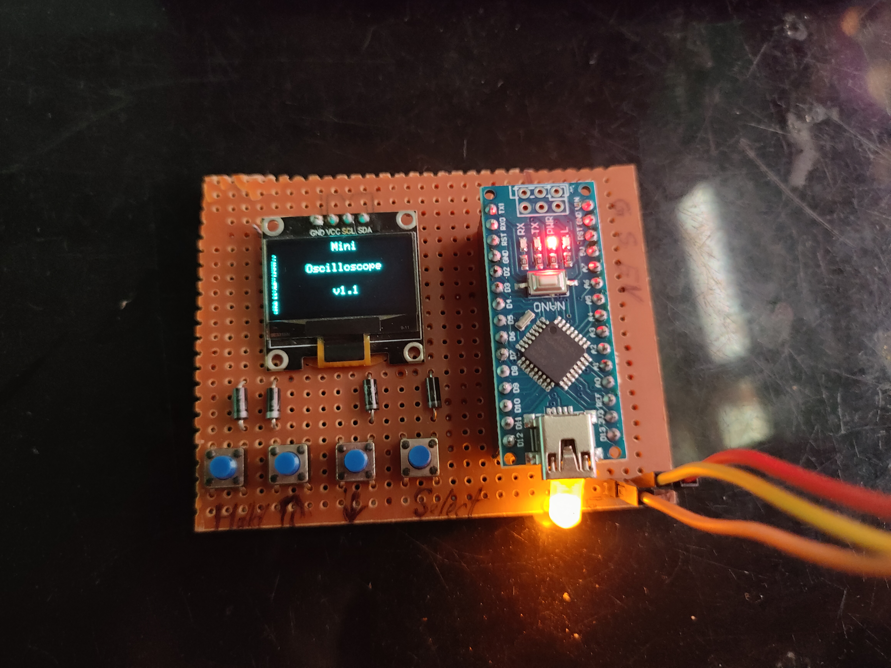

# Day 5 – DIY Arduino Oscilloscope

This project creates a simple oscilloscope using an Arduino and OLED display (or Serial Plotter). It reads analog signals and plots them in real time.

## 📦 Components Used
- Arduino Nano
- OLED Display (SSD1306) 
- 220Ω Resistor (optional)
- Jumper wires + Breadboard

## 🔌 Connections
- OLED SDA → A4
- OLED SCL → A5
- LED (optional) on D13 with 220Ω resistor
- One terminal of all 4 pushbutton to GND 
- Other terminal of  4 pushbutton to D11 ,D10, D9, D8 
- Used 4 diodes  with cathode on each terminal of pushbutton and anode connected together to D2
- 2 10K ohm Resistors are used as voltage devider

## 🧠 How It Works
- Data is plotted live on OLED 
- You can simulate different waveforms using 555 timer or real analog sources

## 📷 Demo

## 🔄 Improvements
- Add real-time axis scaling
- Use ESP32 and TFT for higher resolution
