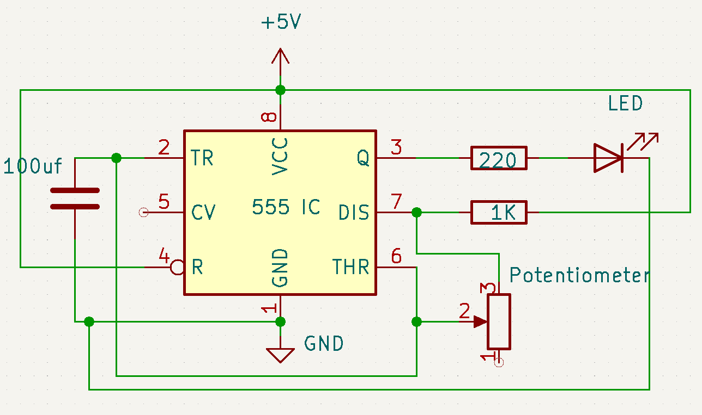

# Day 6 – 555 Timer Variable Frequency Generator

This project demonstrates how to generate a square wave using the 555 timer IC in astable mode, where the frequency is controlled by a 100k potentiometer.

## 🔧 Components Used
- 555 Timer IC
- 100k Potentiometer
- 10µF Capacitor
- LED
- 220Ω Resistor
- Breadboard & Jumper Wires

## ⚙️ Circuit Description
The 555 timer is configured in astable mode. The potentiometer adjusts the charge and discharge time, changing the output frequency. An LED is connected to the output (Pin 3) for visual feedback.

### 📐 Frequency Formula:
\[
f = \frac{1.44}{(R_1 + 2R_2) \times C}
\]

- \( R_1 = \) fixed resistor (or part of the potentiometer)
- \( R_2 = \) variable resistance via potentiometer
- \( C = \) 100µF capacitor

## 📸 Demo

| Circuit Diagram | Project Output |
|-----------------|----------------|
|  |  |

## 🧠 What I Learned
- Configuring the 555 timer in astable mode
- How timing components affect square wave frequency
- Potentiometer as a tunable resistor in timing circuits

