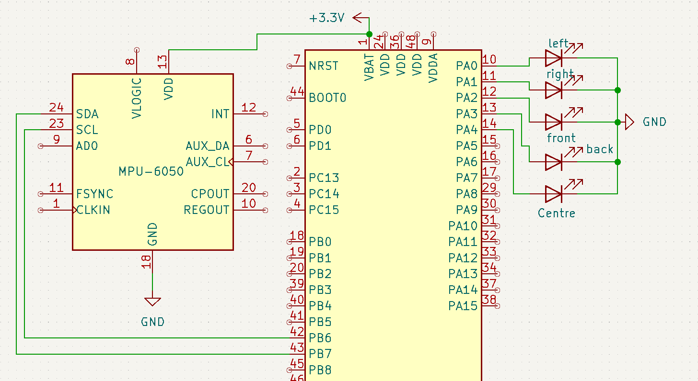

# Day 7 – Tilt Direction Indicator using MPU6050

In this project, we use an MPU6050 accelerometer and gyroscope sensor to detect the tilt of the device and display direction using 5 individual LEDs. Each LED represents a tilt direction — front, back, left, right, and center (flat).

## 📦 Components Used
- STM32 Bluepill
- MPU6050 Sensor
- 5 x LEDs
- 5 x 220Ω Resistors
- Breadboard and Jumper Wires

## ⚙️ Functionality
- The MPU6050 reads accelerometer data to calculate tilt angles along the X and Y axes.
- LEDs light up based on the tilt direction:
  - **Front Tilt (X > +5°)** → LED_FRONT (PA2)
  - **Back Tilt (X < -5°)** → LED_BACK (PA3)
  - **Right Tilt (Y > -95°)** → LED_RIGHT (PA1)
  - **Left Tilt (Y < -85°)** → LED_LEFT (PA0)
  - **Flat/Centered (X and Y between )** → LED_CENTER (PA4)

## 🖼️ Preview
### Circuit Diagram:

### Demo:

## 📤 Output
Real-time angle data (X and Y) is also printed on the Serial Monitor every 200ms

## 🚀 Applications
- Orientation-based device triggers
- Game controller or gesture input
- Balance or position indicators
