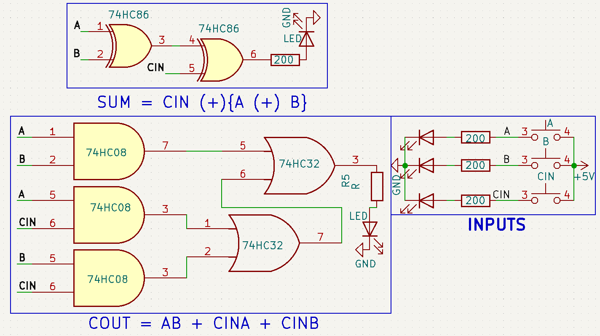
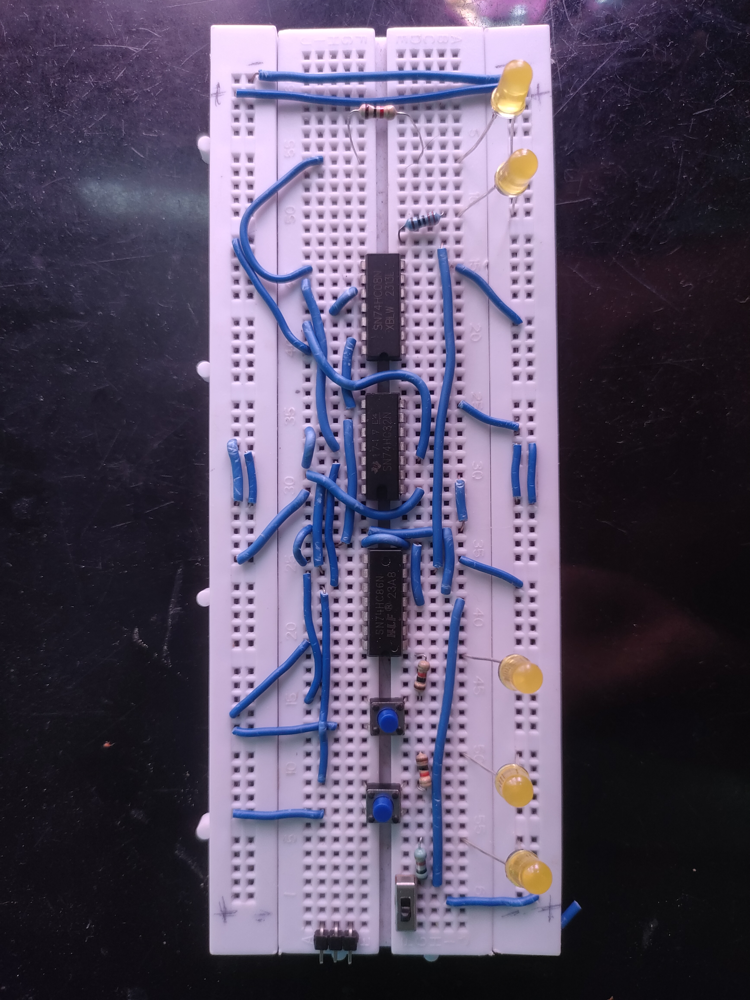

# Day 8 – 1-Bit Full Adder using Logic Gates

A 1-bit full adder built using only 74xx series logic gate ICs — no microcontroller, just pure digital logic!

### 🧠 Logic Used:
- Sum = A ⊕ B ⊕ Cin (XOR gates)
- Cout = (A·B) + CinA + CinB

### 🔧 Components:
- 7486 (XOR gate)
- 7408 (AND gate)
- 7432 (OR gate)
- 3 x LEDs (Sum, Carry Out)
- 3 x Push Buttons (A, B, Cin)
- Breadboard, resistors, 5V supply

### 📷 Demo:

