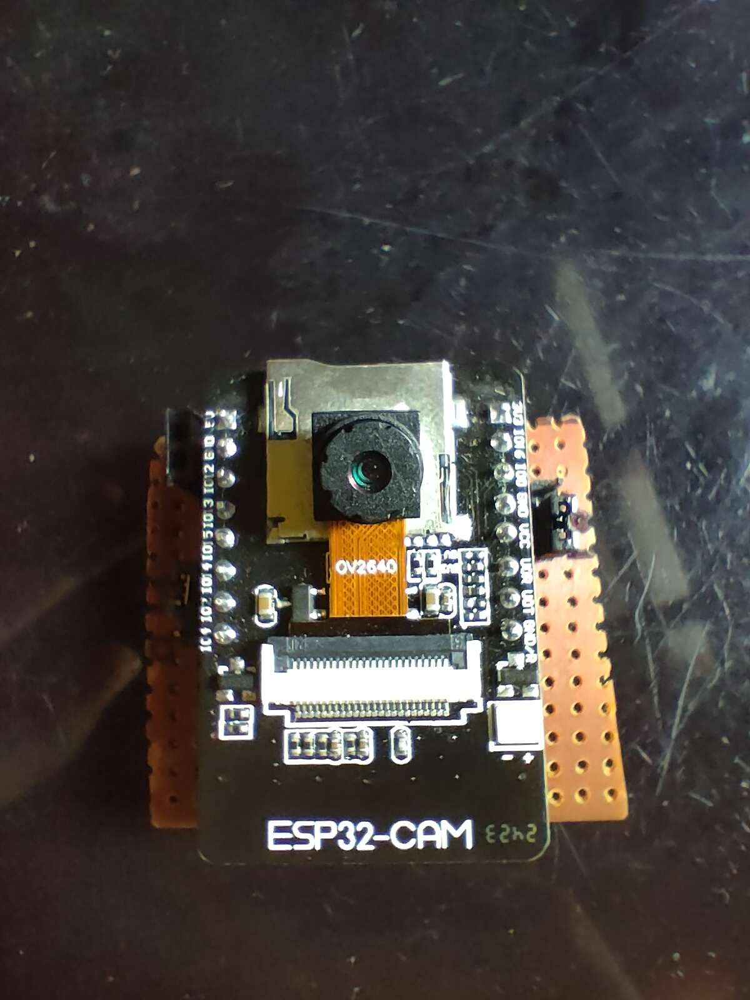

# Day 09 – ESP32-CAM Code Upload Tutorial

This project explains **how to upload code to ESP32-CAM** using two different methods:
1. **FTDI232 USB to Serial Adapter**
2. **Arduino Nano as USB-to-Serial Converter**

---

## 🔧 Method 1: Using FTDI232
### ✅ Connections:
| ESP32-CAM | FTDI232 |
|-----------|---------|
| 5V        | 5V      |
| GND       | GND     |
| U0R       | TX      |
| U0T       | RX      |
| GPIO0     | GND (during upload only) |

### 🔁 Enter Flash Mode:
- Connect GPIO0 to GND
- Press **Reset** (EN) before uploading

---

## 🔧 Method 2: Using Arduino Nano
### ✅ Steps:
- Remove Nano's ATmega328P (or don't upload any sketch)
- Connect pins as:
| ESP32-CAM | Arduino Nano |
|-----------|--------------|
| 5V        | 5V           |
| GND       | GND          |
| U0R       | TX (D1)      |
| U0T       | RX (D0)      |
| GPIO0     | GND          |
| GND     | RESET          |

Use Nano as a USB-Serial bridge.

---

## 💻 Code
Used the Arduino IDE’s example:
**File → Examples → ESP32 → Camera → CameraWebServer**

Make sure to select the correct board:
- **Board**: ESP32 Dev Module
- **Baud Rate**: 115200
- **Partition Scheme**: Huge APP (3MB No OTA)

---

## Note
- After uploading the code remove GPIO0 from GND.
- Press the reset button once after opening the serial monitor.
- Set baud rate to 115200 and you will get the local IP.
- Copy the local IP and paste it in any browser . 
- Scroll down and press on start stream. 

## 📸 Demo

---

