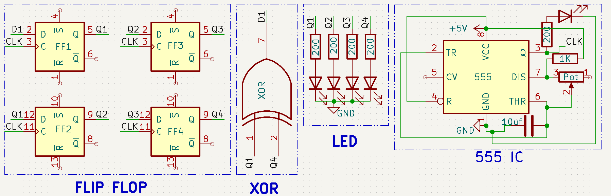

# Day 10 – Pseudo-Random LED Sequence Generator

This project demonstrates a **pseudo-random LED blinking pattern** using only **logic gates and a 7474 flip-flop IC**. It creates a non-repeating pattern that mimics randomness using a Linear Feedback Shift Register (LFSR).

---

## 🧠 Concept

A **4-bit LFSR** is built using:
- A 555 Timer as the clock source
- 7474 D Flip-Flop IC (dual D-FF used as a shift register)
- XOR gate for feedback logic
- 4 LEDs to visualize the output states (Q outputs of flip-flops)

---

## 🔁 How it Works

- Each clock pulse shifts the bits in the register.
- XOR feedback determines the new input bit.
- The LED pattern repeats every 15 steps (maximum for 4-bit LFSR).

---

## 🧰 Components Used

- 555 Timer IC
- 7474 Dual D Flip-Flop IC
- XOR Gate (7400, 7486 or similar)
- 4 LEDs with current limiting resistors
- Breadboard + Jumper Wires
- Capacitors & Resistors for 555 timer setup
- 5V DC Power Supply

---

## 🔌 Circuit Diagram

---

## 💡 Demo

---

## 🗒️ Notes

- The pattern is not truly random, but pseudo-random.
- You can change the feedback tap (e.g., Q1 ⊕ Q4) to get different sequences.
- LFSRs are widely used in applications like scramblers, encryption, and test pattern generators.

---

