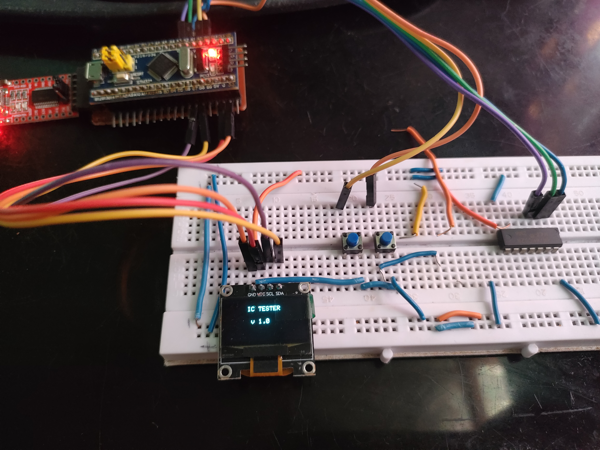
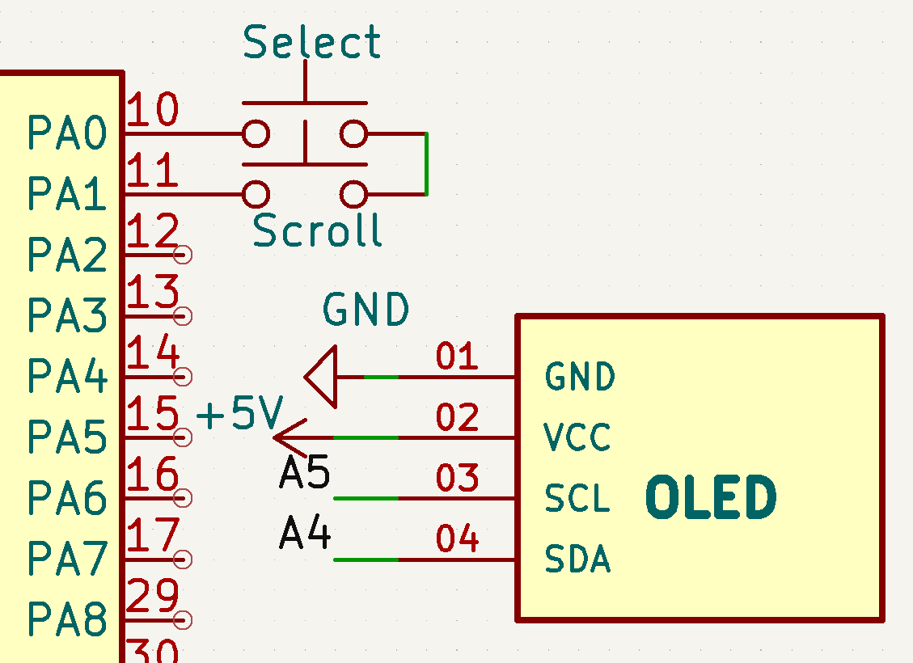

# Day 11 – Logic IC Tester (Part 1 – UI and IC Selection)

This is part 1 of the Logic IC Tester project using STM32 Blue Pill, OLED Display, and Push Buttons. In this part, the user can navigate through a list of 74xx series ICs and select one using buttons. The selected IC's name is displayed along with further options to continue or go back.

## Components Used:
- STM32F103C8T6 (Blue Pill)
- SSD1306 OLED Display (I2C)
- 2x Push Buttons (Scroll & Select)
- 14-Pin IC Socket (for testing)
- Jumper Wires, Breadboard

## Features:
- Scrollable IC selection menu on OLED
- Select option to confirm IC
- Displays connection diagram (planned for Part 2)
- Designed to extend support for multiple 14-pin logic ICs

## Demo:

## Circuit Diagram:

## Next Part:
- Add IC testing logic
- Display test results (Pass/Fail)

