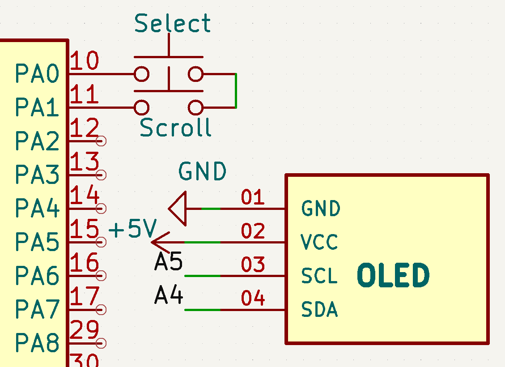

# Day 12 – Logic IC Tester (Part 2 – IC Testing Logic)

This project is the second part of the Logic IC Tester series. It builds upon Part 1 by implementing actual logic gate testing based on truth tables. For this demo, we test a 7402 Quad 2-input NOR gate.

## 🔧 Features

- Tests all 4 logic gates in the IC simultaneously
- Applies all input combinations from the truth table
- Reads IC output pins using STM32 Blue Pill
- Compares output to expected logic levels
- Displays result (`IC Test Passed` or `IC Test Failed`) on OLED

## 🧠 IC Used: 7402 NOR Gate

### Truth Table

| A | B | Y (Output) |
|---|---|------------|
| 0 | 0 | 1          |
| 0 | 1 | 0          |
| 1 | 0 | 0          |
| 1 | 1 | 0          |

### Pin Mapping (IC ↔ STM32)

| IC Pin | Function   | STM32 Pin |
|--------|------------|-----------|
| 1      | A (Gate 1) | PA2       |
| 2      | B (Gate 1) | PA3       |
| 3      | Y (Gate 1) | PA4       |
| 4      | A (Gate 2) | PA5       |
| 5      | B (Gate 2) | PA6       |
| 6      | Y (Gate 2) | PA7       |
| 8      | A (Gate 3) | PB0       |
| 9      | B (Gate 3) | PB1       |
| 10     | Y (Gate 3) | PB3       |
| 11     | A (Gate 4) | PB4       |
| 12     | B (Gate 4) | PB5       |
| 13     | Y (Gate 4) | PB8       |
| 7      | GND        | GND       |
| 14     | VCC        | 5V        |

## 📷 Demo

## 🔌 Circuit Diagram

## 🗂️ Files

- `Day12_LogicICTester_Part2.ino` – Arduino code
- `README.md` – Project details and documentation
- `demo_image.jpg` – OLED output showing result (optional)
- `circuit_diagram.png` – Pin mapping and wiring diagram (optional)

## 📅 Part of:
**30 Days 30 Projects Challenge**
