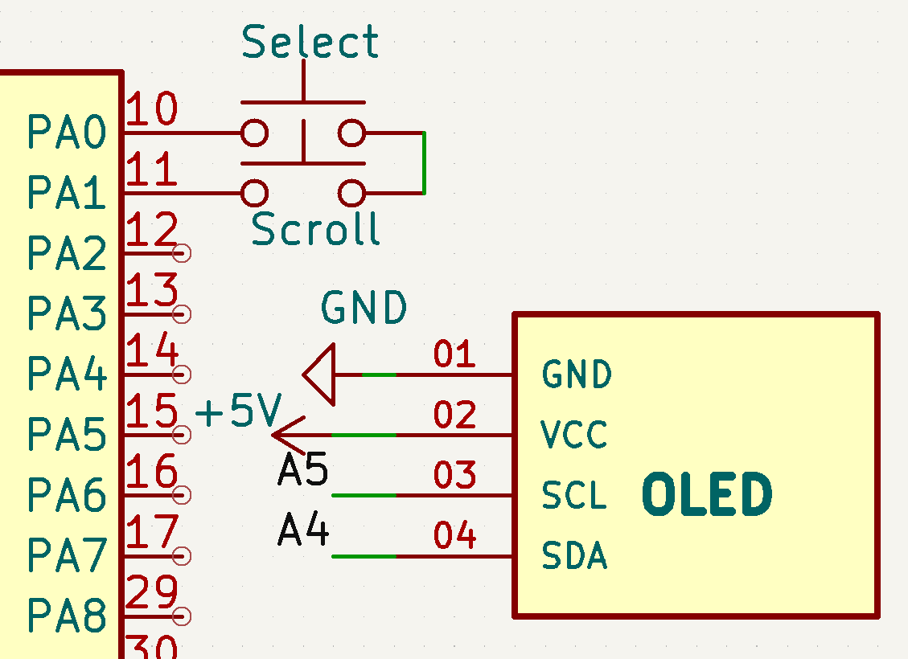
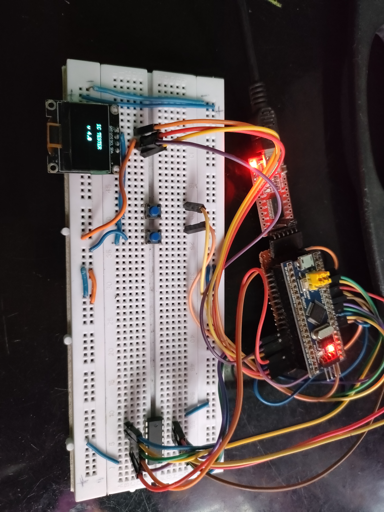

# Day 13 – Logic IC Tester (Gate-wise Fault Display)

🔍 This upgraded version of the Logic IC Tester now displays **gate-specific failures** on the OLED screen, making it easier to identify which gate of the IC is faulty. Helpful for quickly validating ICs like 7400, 7402, 7404, 7408, 7432, 7486, etc.

---

## ✅ Features
- Detects faulty logic gates within a multi-gate IC (e.g., 7408 has 4 AND gates).
- Displays **which specific gate failed** on the OLED.
- Supports multiple IC types: NAND, NOR, NOT, AND, OR, XOR.
- Updated working pin for OUT4 (PB10) due to PB8 pin issue.

---

## 🛠️ Components Used
- STM32 Blue Pill (STM32F103C8T6)
- OLED Display (128x64 I2C)
- Breadboard and jumper wires
- Logic ICs (e.g., 7408, 7400)
- External 5V supply

---

## 🖥️ Wiring (Example: 7408)
| Function | STM32 Pin |
|----------|-----------|
| IN1      | PA2       |
| IN2      | PA3       |
| OUT1     | PA4       |
| IN3      | PA5       |
| IN4      | PA6       |
| OUT2     | PA7       |
| IN5      | PB0       |
| IN6      | PB1       |
| OUT3     | PB3       |
| IN7      | PB4 *(Not working)* - PB8(replaced) |
| IN8      | PB5       |
| OUT4     | **PB10**  |

---

## 🧪 How It Works
- You select an IC from the OLED menu.
- The tester runs inputs through each gate.
- It checks outputs against expected truth tables.
- If any output is incorrect, it prints:  
  **"❌ FAIL: Gate X for input A, B"** on **Serial + OLED**.

---

## 📸 Demo

### 🔌 Circuit Diagram:

### 📷 OLED Test Output:

---

## 📂 Files
- `IC_Tester_GateWise.ino`: Main logic
- `circuit_diagram.png`: Wiring reference
- `demo.jpg`: Sample output (OLED screen)

---

## 🧠 Notes
- PB8 was found non-functional and replaced with PB10.
- Gate-wise testing helps isolate issues in ICs with multiple internal gates.

---

## 🔗 Part of:
[30 Days 30 Projects Challenge](../README.md)
