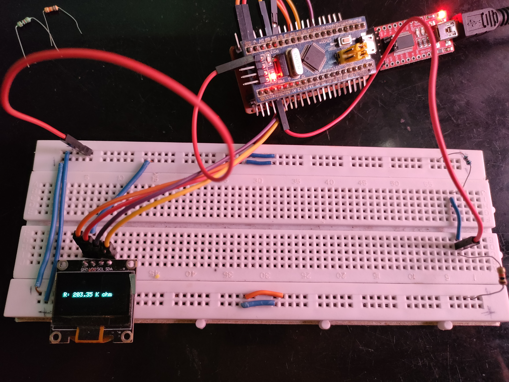
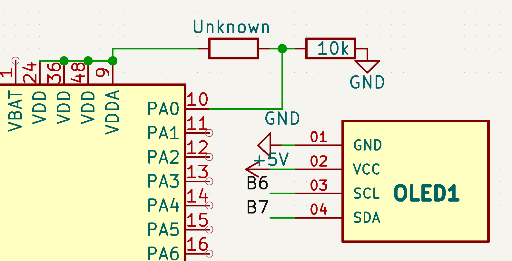

# Day 15 – Smart Resistor Value Finder with OLED UI

This project demonstrates a dual-function tester to measure unknown ** resistor values**  voltage divider method (for resistor). Results are displayed on an OLED display.

## 🧠 Working Principle

- **Resistance Measurement**: Uses voltage divider and analogRead to calculate unknown resistor.

## 📦 Components Used

- STM32 Blue Pill
- SSD1306 OLED Display (I2C)
- Known resistor (10k)
- Unknown resistor
- Breadboard, jumper wires

## 📷 Demo Image

## 🔌 Circuit Diagram

## 📁 Code

File: `Smart_Res_Finder.ino`

- Values displayed on OLED.
- Resistor reading is **averaged over 5 samples** for better accuracy.

---

### 🔗 Mode UI on OLED

- Displays measured value in proper units

---
