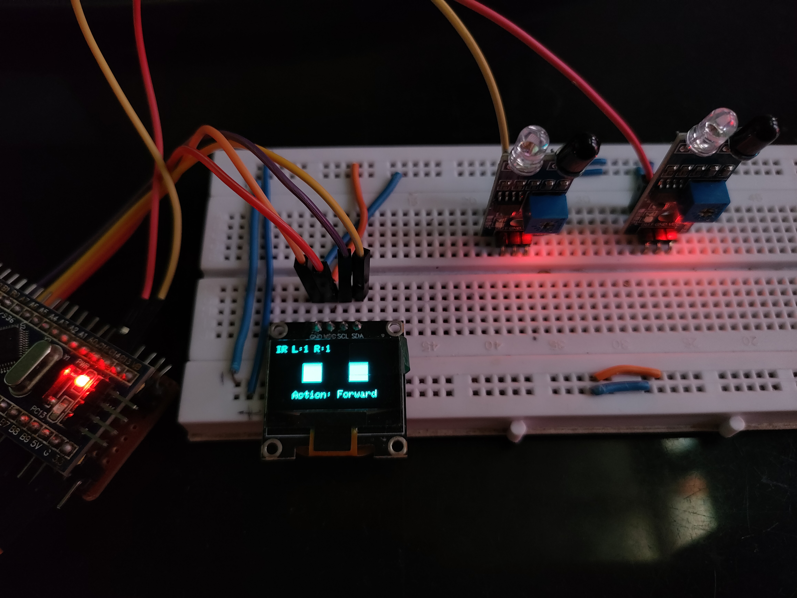

# 2-IR Sensor Line Follower Simulator

This project simulates a line follower robot using **2 IR sensors** and an OLED display. The robot determines direction (Forward, Left, Right, Stop) based on real-time digital readings from the two sensors.

## 🧠 How It Works

- **Left Sensor = LOW** and **Right Sensor = LOW** → Go Forward
- **Left = LOW**, **Right = HIGH** → Turn Left
- **Left = HIGH**, **Right = LOW** → Turn Right
- **Both HIGH** → Stop

The robot's action is visually displayed on an OLED screen.

## 🔧 Components

- STM32 Blue Pill / Arduino Nano
- OLED Display (SSD1306, I2C)
- 2 IR Sensors
- Jumper Wires
- Breadboard

## 📟 OLED Display

The display shows:
- Status of both IR sensors (black/white boxes)
- Action being taken (Straight, Turn Left, etc.)

## 🖼️ Demo

---

> ✅ Great for learning basic logic of IR-based line followers!
