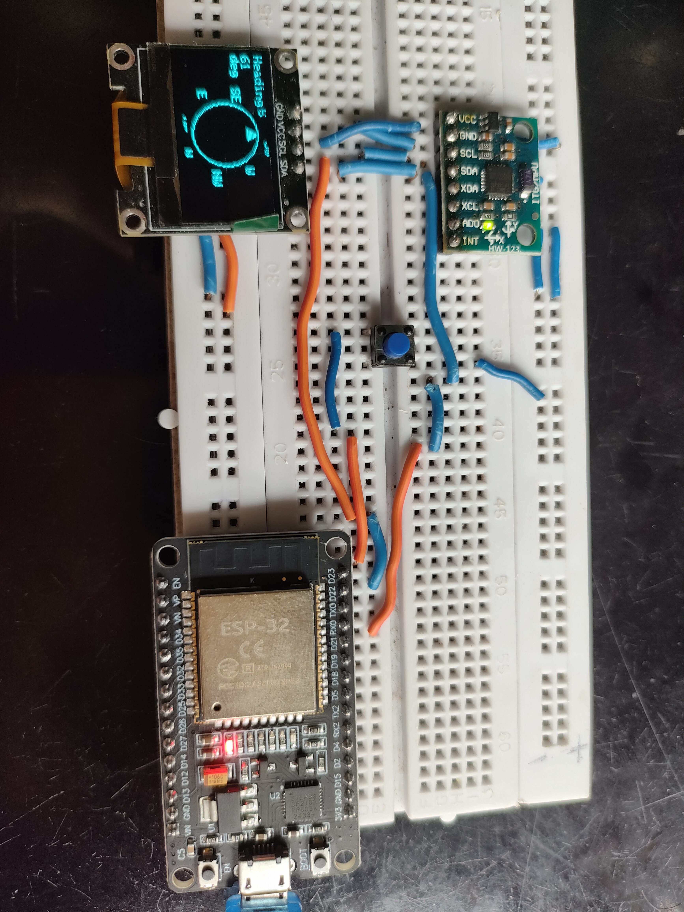
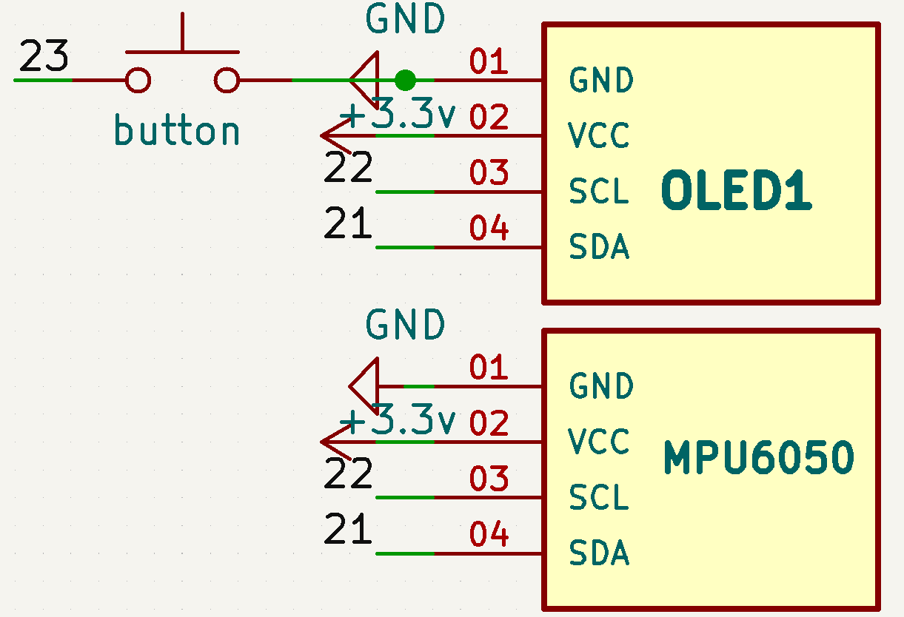

# 📍 Day 17: ESP32 + OLED Digital Compass | 30-Day 30-Project Challenge

Welcome to **Day 17** of my 30-Day 30-Project Challenge! 🚀 Today’s project is a **Digital Compass** using **ESP32**, **MPU6050**, and **OLED Display**. This compass has a fixed arrow pointing North, a rotating circle with directions (N, E, S, W\...), and a one-time calibration feature saved using ESP32's non-volatile `Preferences`.

---

## 🧭 Project: ESP32-Based Digital Compass

### 📷 Demo

---

## 📦 Components Used

| Component       | Description                   |
| --------------- | ----------------------------- |
| ESP32 Dev Board | Main controller               |
| MPU6050         | Gyroscope for yaw/heading     |
| SSD1306 OLED    | 128x64 display for compass UI |
| Push Button     | Used for one-time calibration |

---

## 🔌 Wiring

| Module      | ESP32 GPIO Pin |
| ----------- | -------------- |
| SDA         | GPIO 21        |
| SCL         | GPIO 22        |
| Button      | GPIO 23        |
| OLED VCC    | 3.3V           |
| OLED GND    | GND            |
| MPU6050 VCC | 3.3V           |
| MPU6050 GND | GND            |

---

## 🛠️ Features

* ✅ OLED UI with arrow fixed upward
* ✅ Compass circle rotates based on yaw
* ✅ Direction markers (N, NE, E, S, W\...)
* ✅ One-time auto-calibration stored in Preferences
* ✅ Manual re-calibration using button
* ✅ Reboots with remembered North

---

## 📚 Libraries Used

* `Wire.h`
* `Adafruit_GFX.h`
* `Adafruit_SSD1306.h`
* `MPU6050_light.h`
* `Preferences.h`
* `math.h`

Install them via Library Manager if not already installed.

---

## ▶️ How to Use

1. **Upload the code** to ESP32.
2. On **first boot**, point the compass North.
3. It auto-saves North in EEPROM.
4. Rotate the compass and the directions rotate accordingly.
5. Press the button (GPIO 23) any time to re-calibrate.

---

## 🧠 Behind the Scenes

* The arrow remains fixed at top.
* The circle with direction labels rotates in the **opposite direction** of movement (like a real compass).
* Heading is calculated using MPU6050 yaw (`getAngleZ`).
* Calibration offset is subtracted and saved using `Preferences`.

---

---

## 🏁 Challenge Progress

✅ Day 17 completed successfully! Now onto Day 18...

---

## 📜 License

MIT License - Feel free to modify and use this project for personal or educational purposes.
