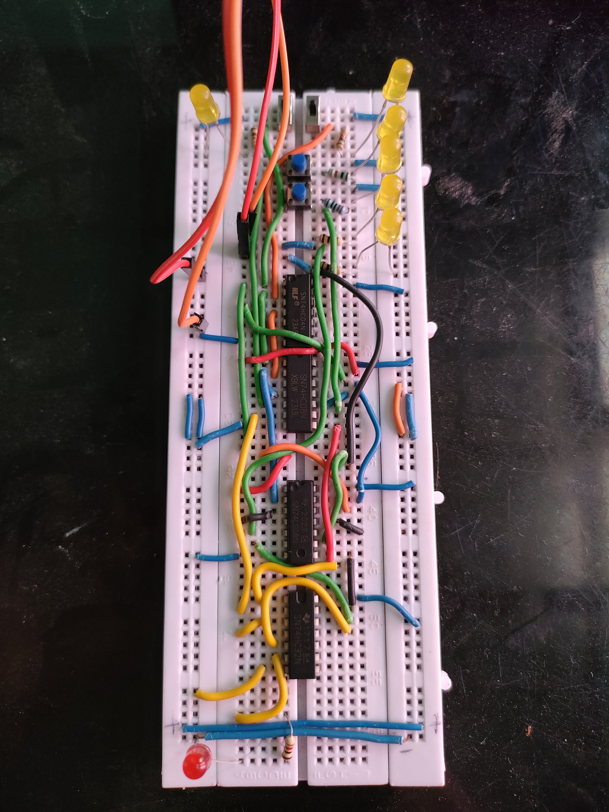
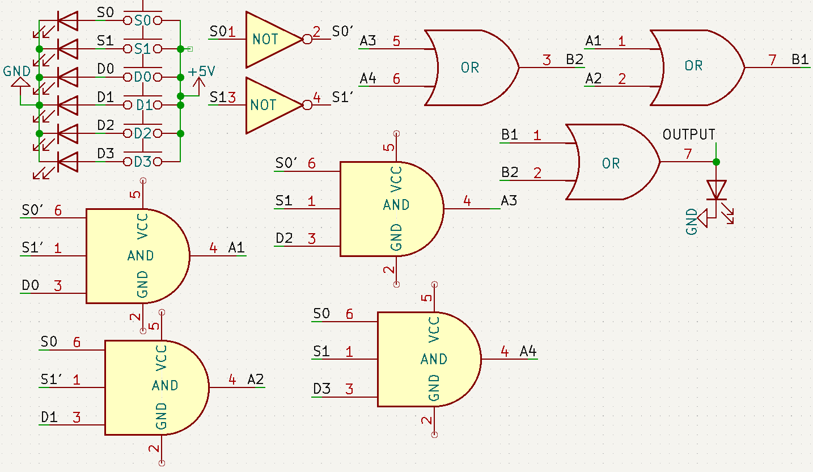
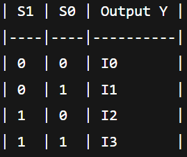

# Day 18: 4-to-1 Multiplexer using Logic Gates

## 🔎 Description
This project demonstrates a 4-to-1 Multiplexer (MUX) built using basic 74xx logic gate ICs — 7408 (AND), 7432 (OR), and 7404 (NOT). It routes one of four data inputs (I0–I3) to the output (Y) based on binary select inputs S1 and S0.

## 🧠 Logic Equation
Y = I0·~S1·~S0 + I1·~S1·S0 + I2·S1·~S0 + I3·S1·S0

## 🧰 Components Used
- 7408 – Quad 2-input AND Gate
- 7432 – Quad 2-input OR Gate
- 7404 – Hex Inverter
- 4 Push Buttons – for I0 to I3
- 2 Jumper Wires – for select lines S0 and S1
- 1 LED – Output Indicator
- Resistors – 330Ω for LED, 10kΩ pull-downs (optional)
- Breadboard, Jumper wires, 5V power supply

## 📊 Truth Table

| S1 | S0 | Output Y |
|----|----|----------|
| 0  | 0  | D0       |
| 0  | 1  | D1       |
| 1  | 0  | D2       |
| 1  | 1  | D3       |

## 🖼️ Demo

## 🔌 Circuit Diagram

##  Truth Table

## ✅ Testing Instructions
1. Use jumper wires to set S1 and S0 HIGH or LOW manually.
2. Press buttons D0 to D3.
3. Only the selected input should reflect on the output LED.
4. Change select lines to test each input path.

## 🧠 Learnings
- Implemented a digital multiplexer without using a dedicated MUX IC.
- Learned how logic gates can decode select lines.
- Great foundational understanding for more complex digital systems.

