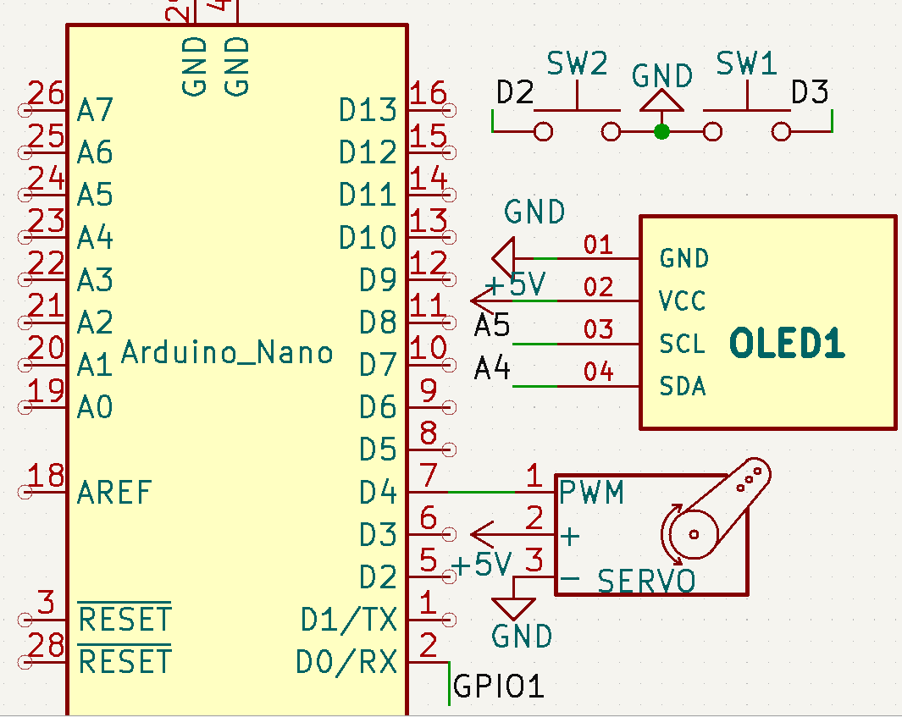
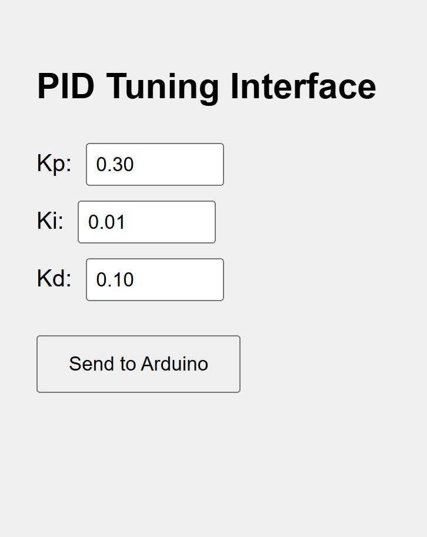

# Day 19 – Web-Based PID Servo Tuner 🔧📶

🎯 **Project Goal**  
Control a servo motor using PID logic (running on Arduino Nano), and **tune the Kp, Ki, Kd values live** from a web interface hosted on an ESP32. An OLED screen displays real-time PID values and servo angle.

---

## 🧠 How It Works

- 🧮 **Arduino Nano** runs PID logic to move the servo
- 🎛️ Two push buttons set target angle (0° or 180°), servo returns to 90°
- 🌐 **ESP32** runs a web server to input PID values
- 🔁 PID values are sent via Serial to the Nano
- 🖥️ **OLED** displays: Kp, Ki, Kd, Setpoint, Current Angle

---

## 🖥️ Components Used

- Arduino Nano  
- ESP32 Dev Board  
- Servo motor (SG90)  
- SSD1306 OLED display (I2C)  
- 2x Push Buttons  
- Jumper wires + breadboard  
- External power source (recommended for servo)

---

## 🔌 Circuit Diagram

> ⚠️ Connect **ESP32 TX → Nano RX (D0)**  
> Power ESP32 and servo via external 5V source  
> Use common GND

---

## 🧾 Code Files

- `Arduino_Nano_PID.ino` → Servo + PID logic + OLED  
- `ESP32_WebServer_PID.ino` → Web page to send PID (via Serial)

---

## 🌐 Web Interface (ESP32)

Enter PID values like:  
1.2,0.0,0.5

# Website Image

These are sent over Serial to the Nano.

---

## 🖼️ Demo Images

| OLED UI 📟            | Full Setup 📸           |
|----------------------|-------------------------|
|  |  |

---

## 🏁 Project Outcome

✅ Tune PID live  
✅ Smooth servo motion  
✅ No continuous rotation  
✅ Responsive button-based control  
✅ Real-time display

---

## 📸 Instagram Caption (for Day 19)

> Day 19: Web-Based PID Servo Tuner 🎯  
>  
> In this project, I tuned a servo motor in real-time using a web interface hosted on an ESP32! The control logic runs on an Arduino Nano, and the OLED display shows the live Kp, Ki, Kd values and angle.  
>  
> 🚀 Two push buttons trigger motion (0° and 180°), then the servo returns to 90° using PID logic.  
>  
> #Arduino #ESP32 #PIDController #30Days30Projects #ServoTuner #IoT #EmbeddedSystems #ElectronicsFun #MakersGonnaMake

---

