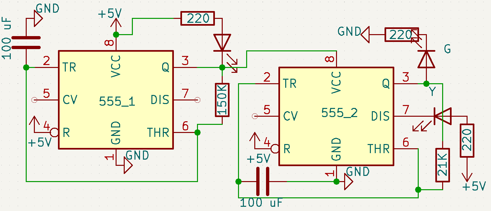
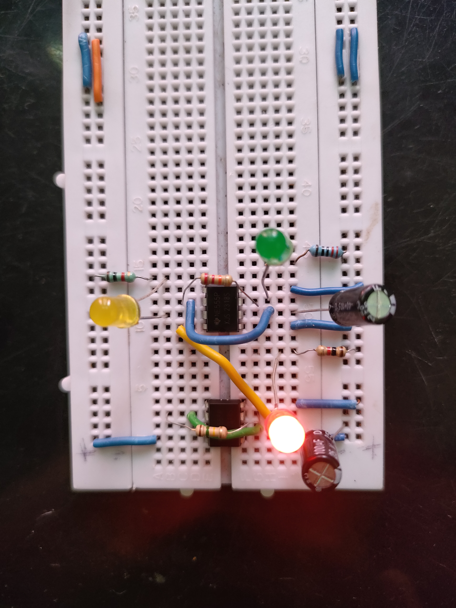

# Day 20 – 555-Based Traffic Light System

## 📌 Overview
A **Traffic Light Simulation** built entirely with **three 555 Timer ICs** in **monostable mode**.  
Each timer controls one LED (Red, Green, or Yellow) with timed delays, simulating a basic traffic light sequence:

🔴 **Red → ~2.3s** → 🟢 **Green → ~2.3s** → 🟡 **Yellow → ~2s** → repeat.

No microcontroller is used — just pure electronics!

---

## 🛠 Components Used
- **2 × 555 Timer ICs**  
- **3 × LEDs** (Red, Green, Yellow)  
- **1 × 21kΩ Resistors** (timing resistors)  
- **2 × 100µF Electrolytic Capacitors** (timing capacitors)  
- **3 × 220Ω Resistors** (LED current limiting)   
- **2 × 100nF Capacitors** (for trigger coupling between timers)  
- **Breadboard & Jumper Wires**  
- **Power Supply: 5V or 9V**

---

## ⚙️ Working Principle
1. Each 555 timer is configured in **monostable mode**:
   - When triggered (Pin 2 pulled LOW briefly), Pin 3 goes HIGH for a specific time.  
   - Time ≈ **1.1 × R × C**

2. The output (Pin 3) of one timer triggers the next timer through a **100nF capacitor**:
   - Red → triggers Green  
   - Green → triggers Yellow  
   - Yellow → triggers Red (completing the loop)

3. The LEDs light up one at a time, each for its set delay.

---

## ⏱ Timing Calculation Example
For R = **21kΩ**, C = **100µF**:
T ≈ 1.1 × R × C
T ≈ 1.1 × 21000 × 100e-6
T ≈ ~2.31 seconds

Change R or C to adjust the delay (e.g., use 47kΩ for ~5 seconds).

---

## 🔗 Circuit Diagram

---

## 🎥 Demo

---

## 🚀 Future Improvements
- Use **47kΩ resistors** for a ~5-second delay (more realistic traffic timing)  
- Add a **pedestrian button** & buzzer for crossing alerts  
- Design a **PCB version** for neatness

---

## 🏷 Project Info
**Project Type:** Pure Electronics (No MCU)  
**Category:** Beginner-Friendly Sequential Logic  
**Day:** 20 / 30  

---

