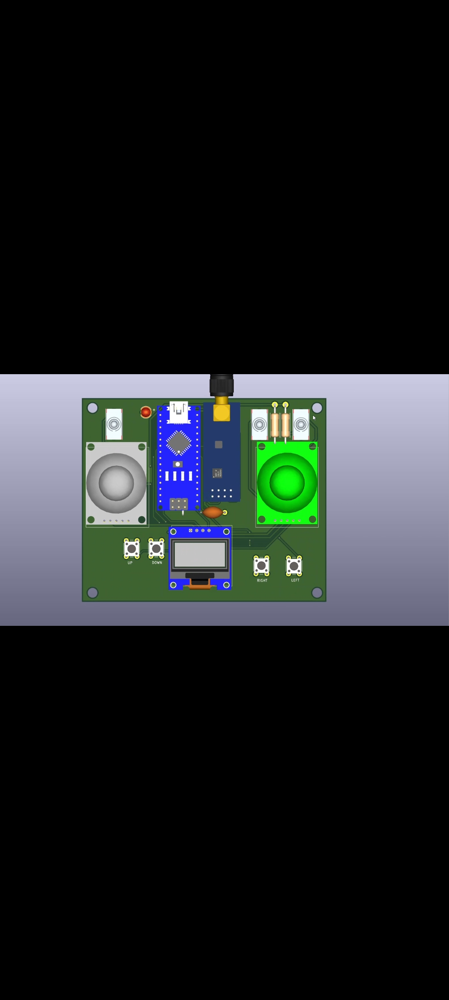

# Day 21 – Transmitter & Receiver with Virtual Joystick (C++ & Python)

## 📌 Overview
A working **wireless transmitter & receiver system** built using NRF24L01 modules.  
The **transmitter sends control data**, the **receiver reads it**, and the data is further processed using a **Python script** to emulate a **virtual joystick** on the computer.

This project demonstrates how to **control games or simulations wirelessly**.

---

## 🛠 Components Used
- **NRF24L01 Transceiver Modules (x2)**  
- **Arduino Nano / STM32 (mention what you used)** for transmitter & receiver  
- **Jumper Wires & Breadboard**  
- **PC running Python 3**  
- **Power Supply (5V / 3.3V)**

---

## 💻 Code Details

### ✅ **C++ (Transmitter & Receiver)**
- `Transmitter_Code.ino` → Reads joystick values (or control inputs) and transmits via NRF24L01  
- `Receiver_Code.ino` → Receives data and sends it to Serial for the computer to process

### ✅ **Python (Virtual Joystick Conversion)**
- `Virtual_Joystick.py` → Reads Serial data from the receiver and converts it into **virtual joystick movements** using libraries like `vJoy` or `pyvjoy`

---

## 🎥 Demo

*(Watch the full video on Instagram)*

---

## 🚀 Future Improvements
- Add **PID filtering** for smoother control  
- Display live data in a **Python UI**  
- Expand to control a real RC car or drone

---

## 🏷 Project Info
**Project Type:** Wireless Communication + Virtual Joystick  
**Category:** Intermediate  
**Languages Used:** C++ (Arduino), Python  
**Day:** 21 / 30
