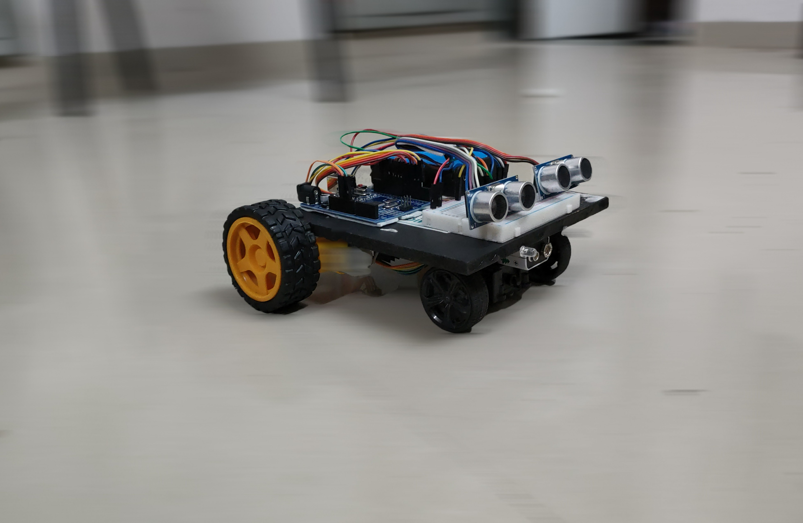
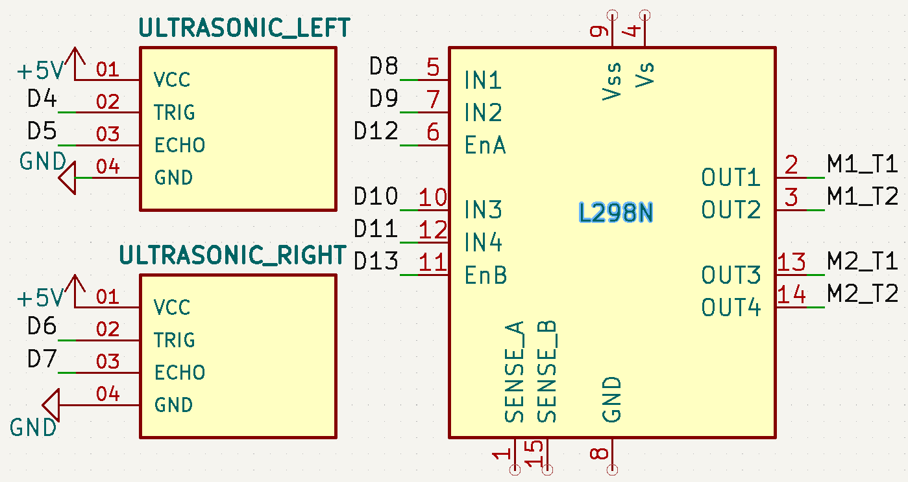

Day 22 – Human-Following Robot Using Ultrasonic Sensors & Arduino
📌 Project Overview
This project demonstrates how to build a Human-Following Robot using two ultrasonic sensors, an L298N motor driver, and an Arduino Uno. The robot detects the position of a human (or any object) in front of it and follows by adjusting its movement direction, maintaining a safe distance.

🛠️ Components Used
Arduino Uno

2 × Ultrasonic Sensors (HC-SR04)

L298N Motor Driver

2 × DC Motors with Wheels

Robot Chassis

9V or 12V Battery

⚡ Working Principle
The two ultrasonic sensors (left and right) continuously measure distances.

If the left sensor detects a closer object, the robot turns left.

If the right sensor detects a closer object, the robot turns right.

If both sensors detect an object at a similar distance, the robot moves forward.

If no object is detected, the robot stops.

📷 Demo Image
 

🔌 Circuit Diagram

Connections:

Ultrasonic Sensor (Left):

VCC → 5V

GND → GND

TRIG → D4

ECHO → D5

Ultrasonic Sensor (Right):

VCC → 5V

GND → GND

TRIG → D6

ECHO → D7

L298N Motor Driver:

IN1 → D8

IN2 → D9

IN3 → D10

IN4 → D11

ENA → D12

ENB → D13

12V → Battery (+)

GND → Battery (-) & Arduino GND

🎯 Output
✅ The robot follows a human/object while maintaining a safe distance.
✅ Adjusts direction based on the closer sensor reading.