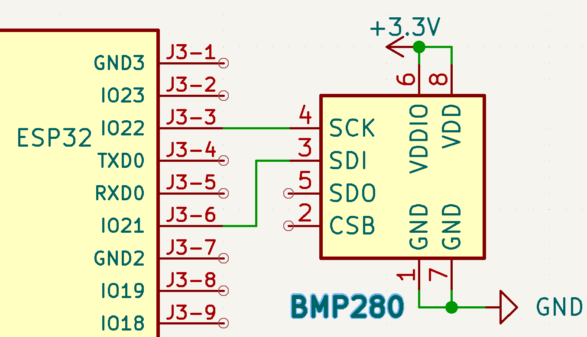
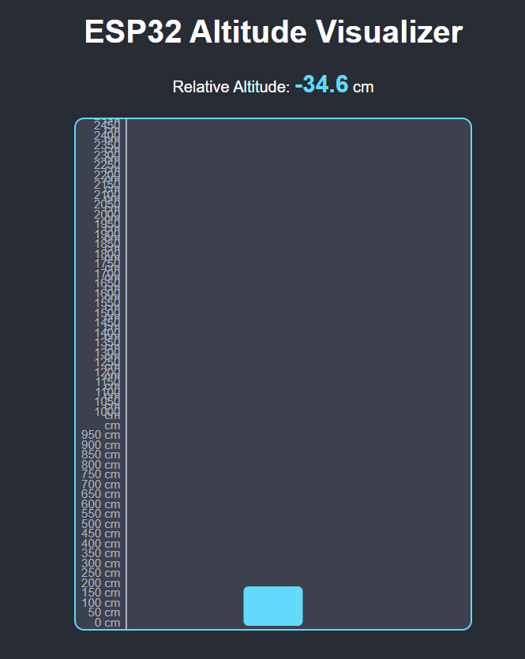

# Day 23 – ESP32 Altitude Visualizer (Web-Based in cm)

## 📌 Overview
This project uses an **ESP32** and **BMP280 sensor** to visualize **relative altitude changes in centimeters (cm)** on a web page hosted by the ESP32.

---

## 🛠 Components Used
- ESP32
- BMP280 (I2C)
- Jumper wires, Breadboard
- Wi-Fi Network

---

## 🔌 Circuit Diagram

## Server 

**Connections:**

| BMP280 | ESP32 |
|--------|-------|
| VCC    | 3.3V  |
| GND    | GND   |
| SDA    | GPIO 21 |
| SCL    | GPIO 22 |

---

## 🚀 Working Principle
1. ESP32 reads altitude data from the BMP280 sensor.  
2. The ESP32 hosts a **real-time updating web page**.  
3. A **blue block** moves up or down based on **altitude change (in cm)**.  
4. The baseline is set when the page first loads.

---

## 🌐 How to Use
1. Upload the code to ESP32.  
2. Open **Serial Monitor (115200 baud)** → Note the IP address.  
3. Open the IP in a web browser.  
4. Move the BMP280 up or down → The block moves accordingly.

---

## 📷 Demo

---

## ✅ Challenge Progress
This project is part of my **30-Days-30-Projects Challenge – Day 23**.
