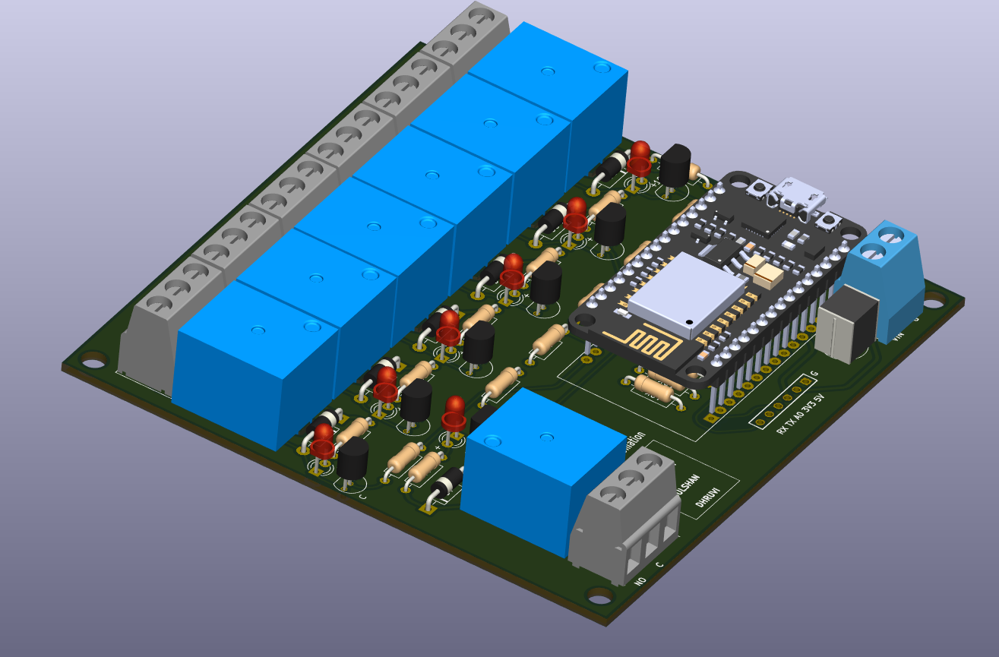
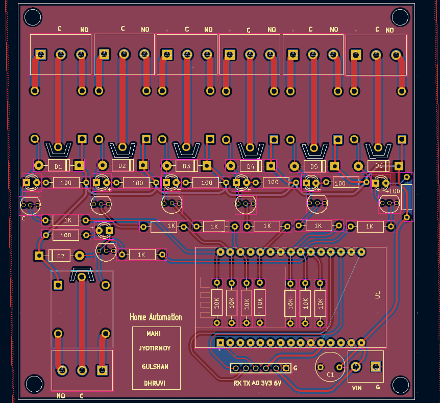

# Day 24 – ESP8266 Home Automation PCB

## 📌 Overview
This project is a custom-designed PCB based on the **ESP8266** (ESP-12E module) for home automation.  
It allows you to control home appliances via Wi-Fi using a compact and efficient PCB design.  
The PCB integrates power regulation, relay driving, and proper safety isolation for reliable operation.

---

## 🛠️ Features
- **Wi-Fi based Control** using ESP8266.
- **Compact PCB Layout** optimized for home automation enclosures.
- **Onboard Relay Driver** to switch AC appliances.
- **LED Indicators** for power and relay status.
- **Screw Terminals** for secure connections.
- Designed for **low-cost, DIY-friendly production**.

---

## 🧩 Components Used
- ESP8266 (ESP-12E or NodeMCU footprint)
- 5V/3.3V Regulator (AMS1117 or similar)
- Relay (5V)
- BC547/2N2222 Transistor for Relay Driving
- 1N4007 Flyback Diode
- Screw Terminals
- Indicator LEDs with Resistors
- Miscellaneous Passive Components

---

