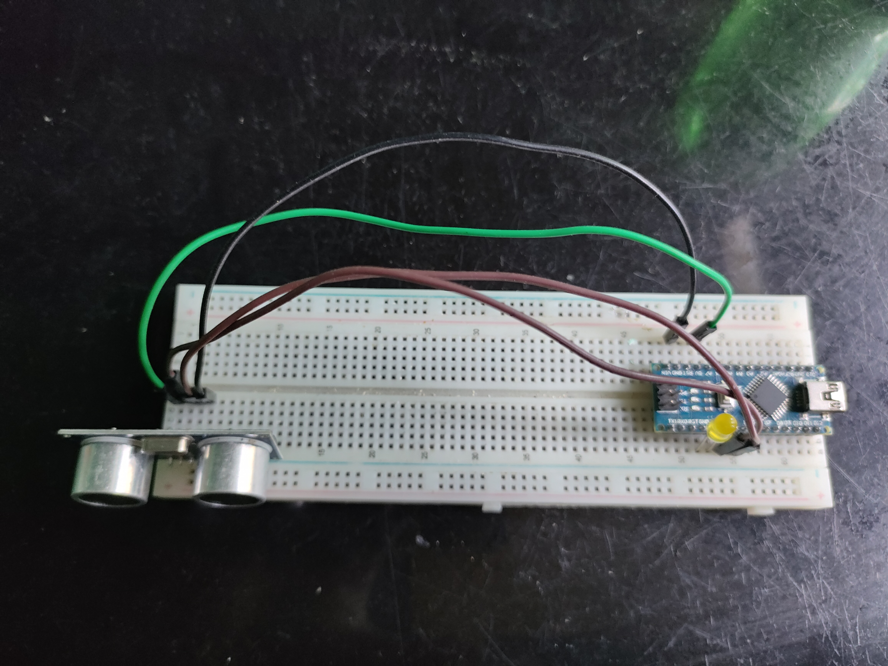
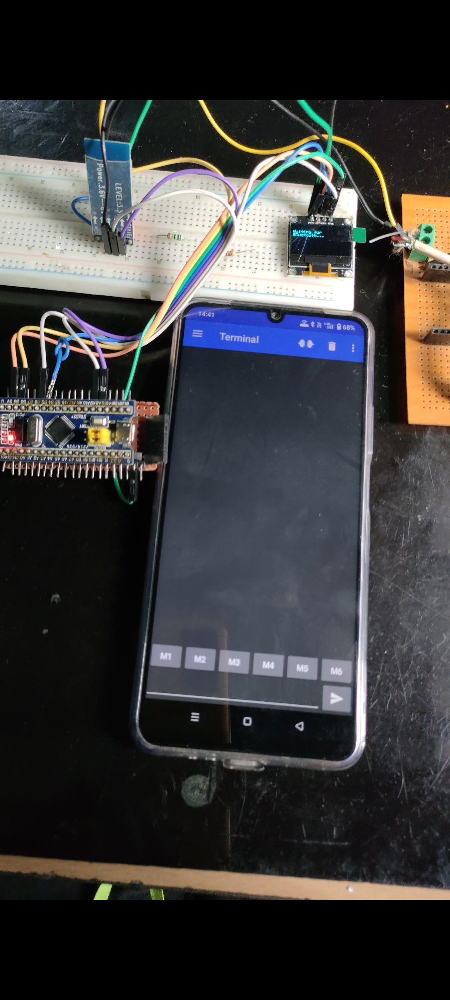
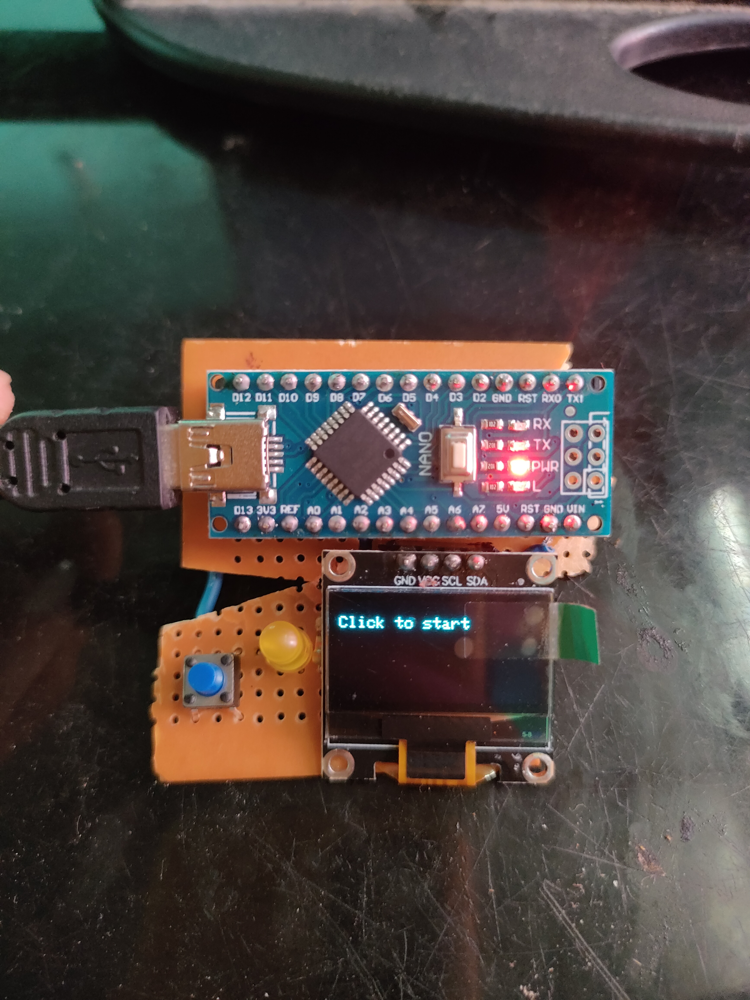

# 🔧 30 Days 30 Project Challenge

Welcome to my 30-day electronics challenge!  
Each day, I build and share a new project using microcontrollers, sensors, and modules I have at home.  
Follow along and get inspired to build your own!

---

## 📅 Projects List

### ✅ Day 1 – Touchless LED Switch  
A simple Ultrasonic sensor-based switch to control an LED without touching it.  
📂 [Project Folder](./Day01_Touchless_LED_Switch)  
📷 Demo: 

---

### ✅ Day 2 – Wireless Notice Board  
STM32 Bluepill + OLED display + HC-05 Bluetooth module to display text wirelessly from your phone.  
📂 [Project Folder](./Day02_Wireless_Notice_Board)  
📷 Demo: 

---

### ✅ Day 3 – Mini Weather Station  
ESP8266 + BMP280 sensor reads temperature and pressure, and shows it on a live web server that auto-refreshes.  
📂 [Project Folder](./Day03_Mini_Weather_Station)  
📷 Demo: 

---

---

### ✅ Day 4 – Reaction Timer Game  
A fun Arduino project that tests your reflexes! Press the button as soon as the LED lights up to measure your reaction speed.  
📂 [Project Folder](./Day04_Reaction_Timer_Game)  
📷 Demo: 

---

## 📌 Follow me on Instagram  
👉 [@jyotirmakes](https://www.instagram.com/jyotirmakes?igsh=dXhyYWc5bWsyMWgw)

