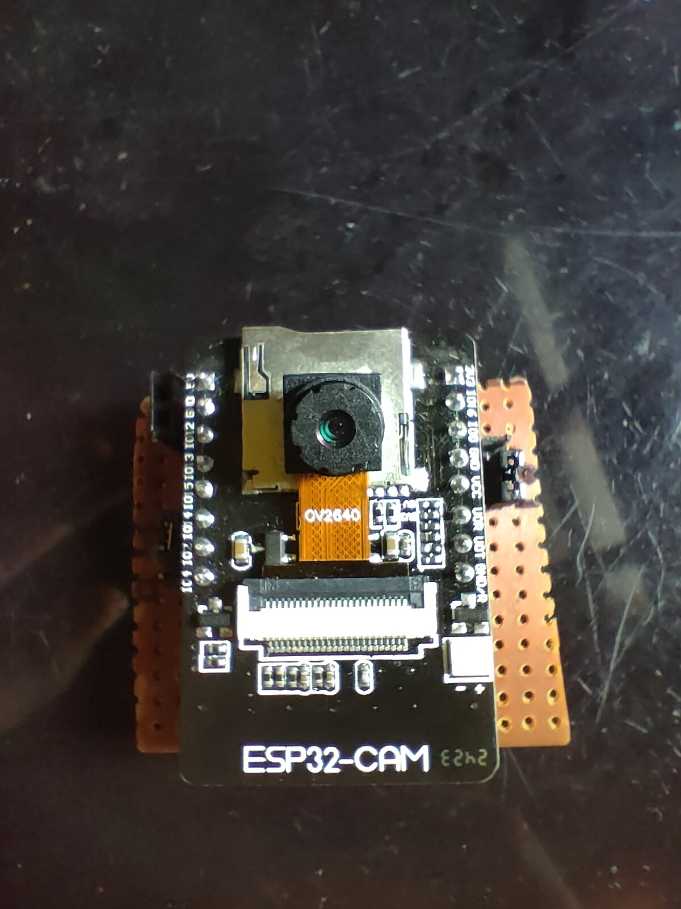
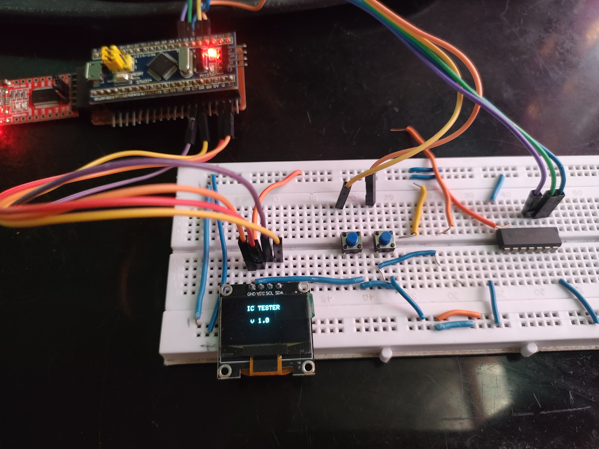
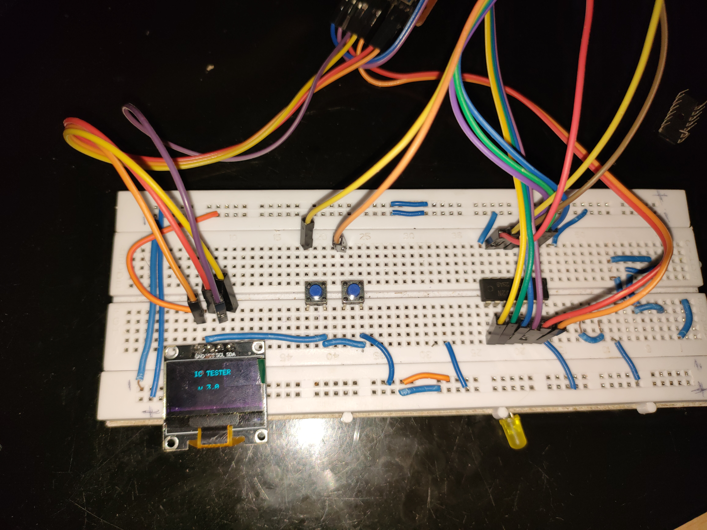

# 🔧 30 Days 30 Project Challenge

Welcome to my 30-day electronics challenge!  
Each day, I build and share a new project using microcontrollers, sensors, and modules I have at home.  
Follow along and get inspired to build your own!

---

## 📅 Projects List

### ✅ Day 1 – Touchless LED Switch  
A simple Ultrasonic sensor-based switch to control an LED without touching it.  
📂 [Project Folder](./Day01_Touchless_LED_Switch)  
📷 Demo: 

---

### ✅ Day 2 – Wireless Notice Board  
STM32 Bluepill + OLED display + HC-05 Bluetooth module to display text wirelessly from your phone.  
📂 [Project Folder](./Day02_Wireless_Notice_Board)  
📷 Demo: 

---

### ✅ Day 3 – Mini Weather Station  
ESP8266 + BMP280 sensor reads temperature and pressure, and shows it on a live web server that auto-refreshes.  
📂 [Project Folder](./Day03_Mini_Weather_Station)  
📷 Demo: 

---

---

### ✅ Day 4 – Reaction Timer Game  
A fun Arduino project that tests your reflexes! Press the button as soon as the LED lights up to measure your reaction speed.  
📂 [Project Folder](./Day04_Reaction_Timer_Game)

### 📸 Demo:
 

---

---

## 📅 Day 5 – DIY Arduino Oscilloscope

In this project, I built a simple oscilloscope using an Arduino to visualize analog signals like a potentiometer sweep or a 555 timer square wave.

### 🔧 Components Used:
- Arduino Nano
- OLED Display (SSD1306) 
- Jumper wires and breadboard

### 🧠 What It Does:
- Data is plotted live on OLED
- You can simulate different waveforms using 555 timer or real analog sources

### 📸 Demo:

➡️ [Project Folder](Day05_Arduino_Oscilloscope)

---

---

## 📅 Day 06 – 555 Timer Variable Frequency Generator

This project demonstrates a square wave generator using the 555 timer in astable mode. A 100k potentiometer is used to adjust the frequency of the output signal. The LED blinks at a speed that depends on the resistance.

### 🔧 Components:
- 555 Timer IC  
- 100k Potentiometer  
- 10µF Capacitor  
- LED  
- 220Ω Resistor  
- Breadboard, Wires

### 🔍 Summary:
- Generates variable frequency square waves.
- LED indicates frequency through blinking.
- Great for learning timing circuits and signal generation.

🔗 [View Project Folder](./Day06_555_Timer_Variable_Frequency)

### 📸 Demo:

---

### 📅 Day 7 – Tilt Direction Indicator (MPU6050 + STM32)

This project uses the MPU6050 sensor to detect tilt direction and lights up 5 different LEDs for:
- Front
- Back
- Left
- Right
- Center (flat surface)

👉 [Project Folder](Day07_Tilt_Direction_Indicator)

### 📸 Demo:

---

### 📅 Day 8 – 1-Bit Full Adder (Logic Gate Circuit)

Built a functional 1-bit full adder circuit using 7486, 7408, and 7432 logic gate ICs. This is a basic yet powerful demonstration of combinational digital logic without any microcontroller.

👉 [Project Folder](Day08_1Bit_Full_Adder)

### 📸 Demo:

---

### Day 09 – ESP32-CAM Code Upload Tutorial  
In this project, I explained how to upload code to the ESP32-CAM using either an FTDI232 USB-to-Serial adapter or an Arduino Nano.  
📁 [Project Files](./Day09_ESP32CAM_Code_Upload_Tutorial)  

### 📸 Demo:

---

### 🔟 Day 10 – Pseudo-Random LED Sequence Generator

This project demonstrates how to generate a pseudo-random blinking pattern using logic gates and a 7474 D Flip-Flop IC. A 555 timer provides the clock pulses, and the sequence is produced using a linear feedback shift register (LFSR). This hardware-only project mimics randomness and cycles through a non-repeating pattern across 4 LEDs.

📂 [Project Folder](./Day10_Pseudo_Random_LED_Sequence)  
📷 

---

## Day 11 – Logic IC Tester (Part 1 – UI and IC Selection)

Build a scrolling IC selector using OLED and push buttons for 74xx logic ICs. This project is modular and will be extended to test logic gates based on selected IC.
📷 
[🔗 View Project Folder](./Day11_Logic_IC_Tester_Part1)

---

## Day 12 – Logic IC Tester (Part 2 – UI and Debugging)
This is the second part of the Logic IC Tester. After selecting a logic IC from the OLED menu (built in Part 1), this part tests the selected IC’s functionality by applying input logic levels and checking outputs based on the truth table. If any gate fails, it identifies the faulty output pin. If all gates pass, it prints “IC Test Passed” on the OLED.
📷 
[🔗 View Project Folder](./Day12_Logic_IC_Tester_Part2)

---

## 📌 Follow me on Instagram  
👉 [@jyotirmakes](https://www.instagram.com/jyotirmakes?igsh=dXhyYWc5bWsyMWgw)

