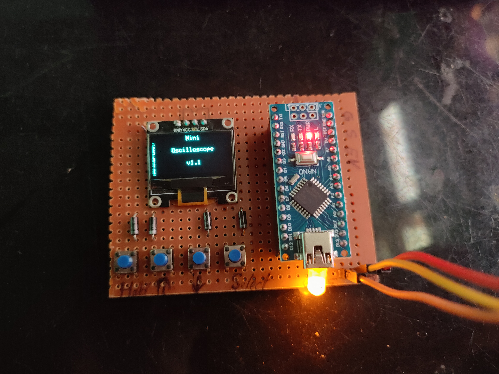
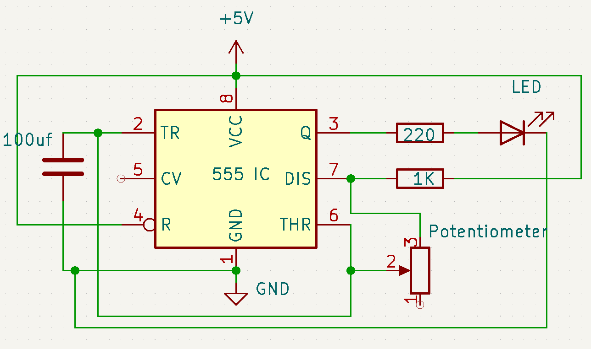

# 🔧 30 Days 30 Project Challenge

Welcome to my 30-day electronics challenge!  
Each day, I build and share a new project using microcontrollers, sensors, and modules I have at home.  
Follow along and get inspired to build your own!

---

## 📅 Projects List

### ✅ Day 1 – Touchless LED Switch  
A simple Ultrasonic sensor-based switch to control an LED without touching it.  
📂 [Project Folder](./Day01_Touchless_LED_Switch)  
📷 Demo: 

---

### ✅ Day 2 – Wireless Notice Board  
STM32 Bluepill + OLED display + HC-05 Bluetooth module to display text wirelessly from your phone.  
📂 [Project Folder](./Day02_Wireless_Notice_Board)  
📷 Demo: 

---

### ✅ Day 3 – Mini Weather Station  
ESP8266 + BMP280 sensor reads temperature and pressure, and shows it on a live web server that auto-refreshes.  
📂 [Project Folder](./Day03_Mini_Weather_Station)  
📷 Demo: 

---

---

### ✅ Day 4 – Reaction Timer Game  
A fun Arduino project that tests your reflexes! Press the button as soon as the LED lights up to measure your reaction speed.  
📂 [Project Folder](./Day04_Reaction_Timer_Game)  
📷 Demo: 

---

---

## 📅 Day 5 – DIY Arduino Oscilloscope

In this project, I built a simple oscilloscope using an Arduino to visualize analog signals like a potentiometer sweep or a 555 timer square wave.

### 🔧 Components Used:
- Arduino Nano
- OLED Display (SSD1306) 
- Jumper wires and breadboard

### 🧠 What It Does:
- Data is plotted live on OLED
- You can simulate different waveforms using 555 timer or real analog sources

### 📸 Demo:

➡️ [Project Folder](Day05_Arduino_Oscilloscope)

---

---

## 📅 Day 06 – 555 Timer Variable Frequency Generator

This project uses a 555 timer IC in astable mode to generate a square wave. A 100k potentiometer is used to vary the frequency dynamically.

### 🔧 Components:
- 555 Timer IC  
- 100k Potentiometer  
- 10µF Capacitor  
- LED + Resistor  
- Breadboard, Wires

### 🔍 Summary:
- The LED blinks faster or slower based on the potentiometer position.
- Frequency is calculated using the standard 555 astable formula.
- Great for understanding timing circuits and waveform generation.

🔗 [View Project Folder](./Day06_555_Timer_Variable_Frequency)

---

## 📌 Follow me on Instagram  
👉 [@jyotirmakes](https://www.instagram.com/jyotirmakes?igsh=dXhyYWc5bWsyMWgw)

