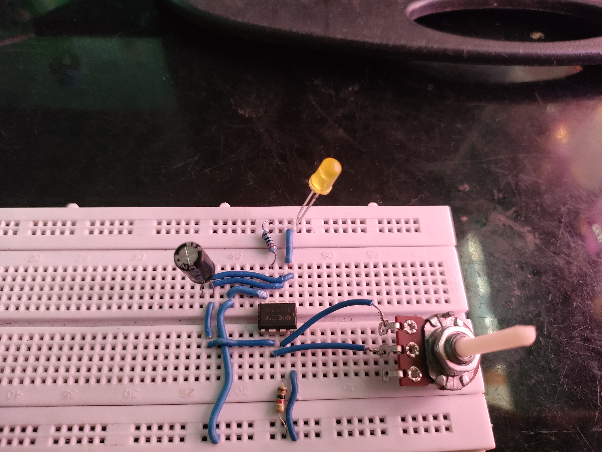
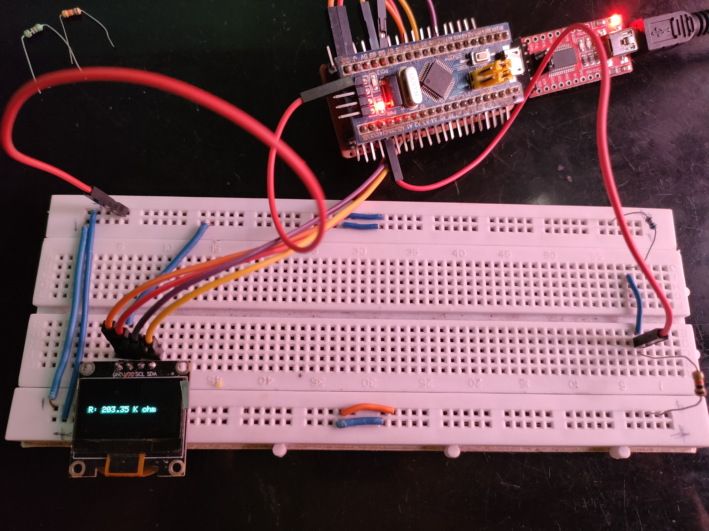
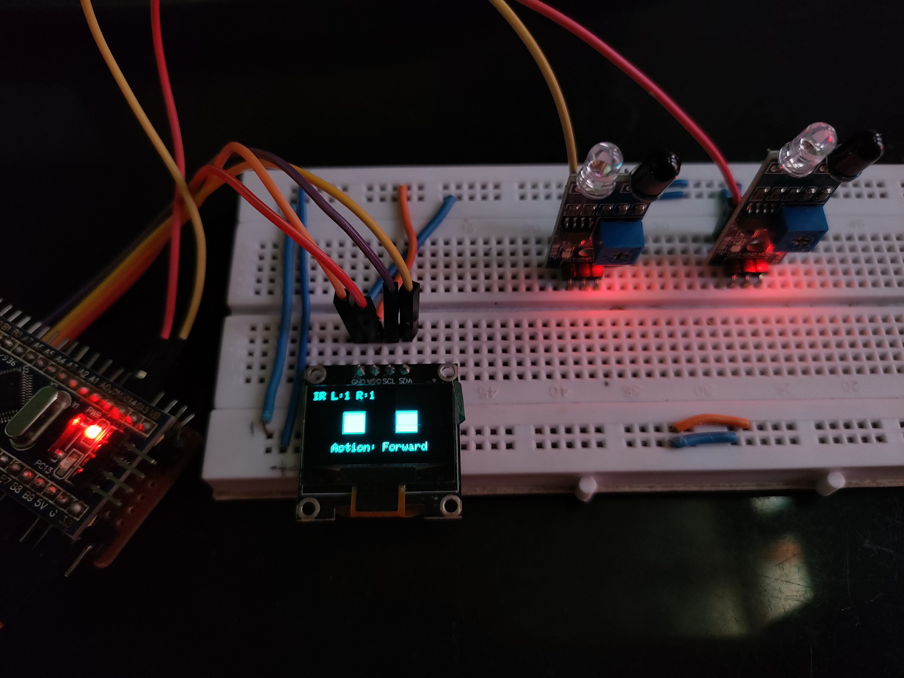
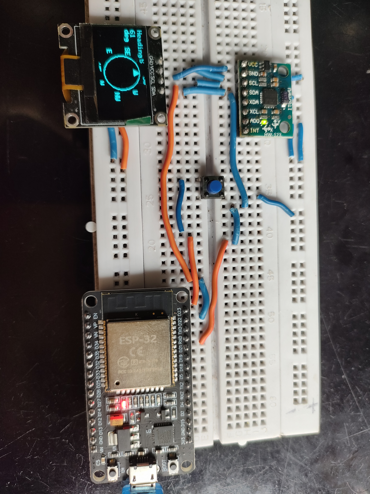
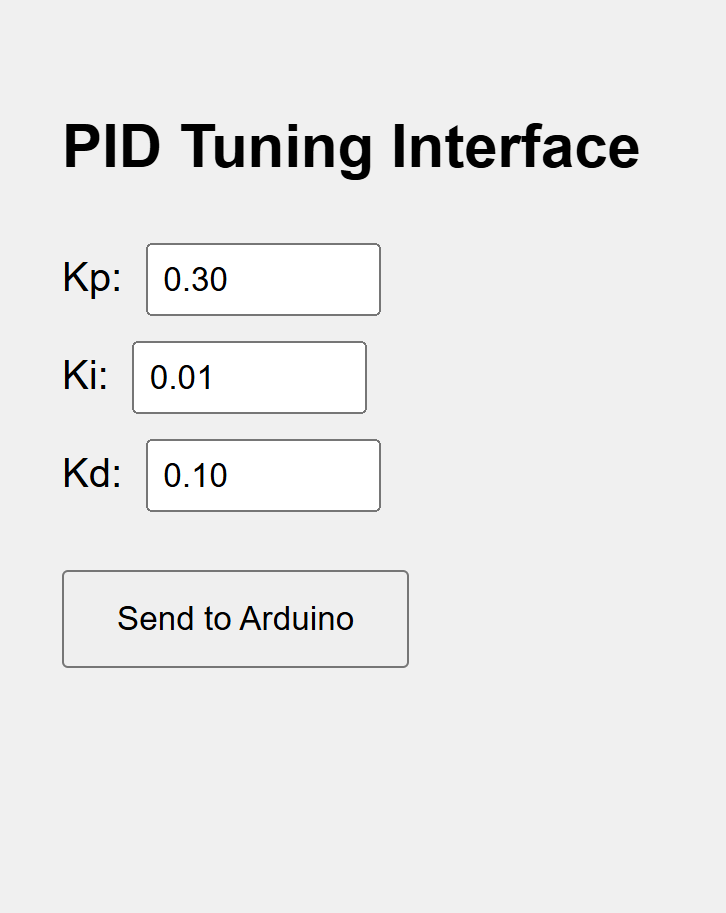
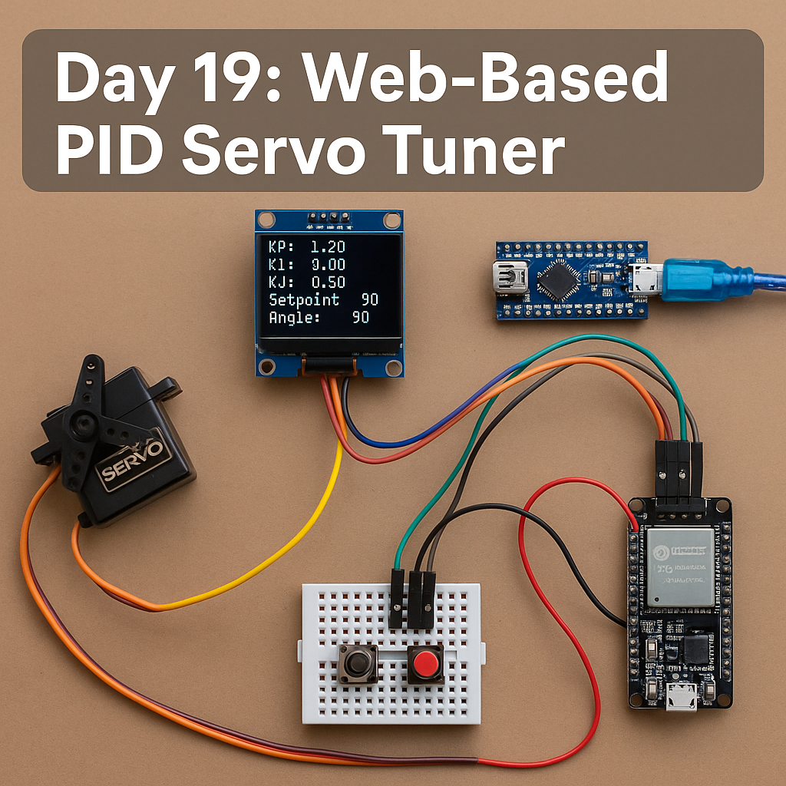

# 🔧 30 Days 30 Project Challenge

Welcome to my 30-day electronics challenge!  
Each day, I build and share a new project using microcontrollers, sensors, and modules I have at home.  
Follow along and get inspired to build your own!

---

## 📅 Projects List

### ✅ Day 1 – Touchless LED Switch  
A simple Ultrasonic sensor-based switch to control an LED without touching it.  
📂 [Project Folder](./Day01_Touchless_LED_Switch)  
📷 Demo: 

---

### ✅ Day 2 – Wireless Notice Board  
STM32 Bluepill + OLED display + HC-05 Bluetooth module to display text wirelessly from your phone.  
📂 [Project Folder](./Day02_Wireless_Notice_Board)  
📷 Demo: 

---

### ✅ Day 3 – Mini Weather Station  
ESP8266 + BMP280 sensor reads temperature and pressure, and shows it on a live web server that auto-refreshes.  
📂 [Project Folder](./Day03_Mini_Weather_Station)  
📷 Demo: 

---

---

### ✅ Day 4 – Reaction Timer Game  
A fun Arduino project that tests your reflexes! Press the button as soon as the LED lights up to measure your reaction speed.  
📂 [Project Folder](./Day04_Reaction_Timer_Game)

### 📸 Demo:
 

---

---

## 📅 Day 5 – DIY Arduino Oscilloscope

In this project, I built a simple oscilloscope using an Arduino to visualize analog signals like a potentiometer sweep or a 555 timer square wave.

### 🔧 Components Used:
- Arduino Nano
- OLED Display (SSD1306) 
- Jumper wires and breadboard

### 🧠 What It Does:
- Data is plotted live on OLED
- You can simulate different waveforms using 555 timer or real analog sources

### 📸 Demo:

➡️ [Project Folder](Day05_Arduino_Oscilloscope)

---

---

## 📅 Day 06 – 555 Timer Variable Frequency Generator

This project demonstrates a square wave generator using the 555 timer in astable mode. A 100k potentiometer is used to adjust the frequency of the output signal. The LED blinks at a speed that depends on the resistance.

### 🔧 Components:
- 555 Timer IC  
- 100k Potentiometer  
- 10µF Capacitor  
- LED  
- 220Ω Resistor  
- Breadboard, Wires

### 🔍 Summary:
- Generates variable frequency square waves.
- LED indicates frequency through blinking.
- Great for learning timing circuits and signal generation.

🔗 [View Project Folder](./Day06_555_Timer_Variable_Frequency)

### 📸 Demo:

---

### 📅 Day 7 – Tilt Direction Indicator (MPU6050 + STM32)

This project uses the MPU6050 sensor to detect tilt direction and lights up 5 different LEDs for:
- Front
- Back
- Left
- Right
- Center (flat surface)

👉 [Project Folder](Day07_Tilt_Direction_Indicator)

### 📸 Demo:

---

### 📅 Day 8 – 1-Bit Full Adder (Logic Gate Circuit)

Built a functional 1-bit full adder circuit using 7486, 7408, and 7432 logic gate ICs. This is a basic yet powerful demonstration of combinational digital logic without any microcontroller.

👉 [Project Folder](Day08_1Bit_Full_Adder)

### 📸 Demo:

---

### Day 09 – ESP32-CAM Code Upload Tutorial  
In this project, I explained how to upload code to the ESP32-CAM using either an FTDI232 USB-to-Serial adapter or an Arduino Nano.  
📁 [Project Files](./Day09_ESP32CAM_Code_Upload_Tutorial)  

### 📸 Demo:

---

### 🔟 Day 10 – Pseudo-Random LED Sequence Generator

This project demonstrates how to generate a pseudo-random blinking pattern using logic gates and a 7474 D Flip-Flop IC. A 555 timer provides the clock pulses, and the sequence is produced using a linear feedback shift register (LFSR). This hardware-only project mimics randomness and cycles through a non-repeating pattern across 4 LEDs.

📂 [Project Folder](./Day10_Pseudo_Random_LED_Sequence)  
📷 

---

## Day 11 – Logic IC Tester (Part 1 – UI and IC Selection)

Build a scrolling IC selector using OLED and push buttons for 74xx logic ICs. This project is modular and will be extended to test logic gates based on selected IC.
📷 
[🔗 View Project Folder](./Day11_Logic_IC_Tester_Part1)

---

## Day 12 – Logic IC Tester (Part 2 – UI and Debugging)
This is the second part of the Logic IC Tester. After selecting a logic IC from the OLED menu (built in Part 1), this part tests the selected IC’s functionality by applying input logic levels and checking outputs based on the truth table. If any gate fails, it identifies the faulty output pin. If all gates pass, it prints “IC Test Passed” on the OLED.
📷 
[🔗 View Project Folder](./Day12_Logic_IC_Tester_Part2)

---

# 🔍 Day 13 – Logic IC Tester (Part 3 – Gate-wise Fault Display)

This is the third and final part of the Logic IC Tester project. In this version, we’ve added gate-wise fault detection to clearly identify which gate (1 to 4) failed during testing. Each gate is tested independently, and the result is shown on the OLED display.

---

## 📷 Demo Image

📷 
---

## 🧠 Features

- ✅ Supports multiple ICs like **7400, 7402, 7404, 7408, 7432, 7486**
- 📋 IC is auto-tested with each gate input combination
- 📺 Displays result for each gate (PASS/FAIL) on **OLED**
- 🔁 Scroll button for IC selection, Select button to run test

---

## 🧾 ICs Tested

| IC     | Type         |
|--------|--------------|
| 7400   | NAND Gate    |
| 7402   | NOR Gate     |
| 7404   | NOT Gate     |
| 7408   | AND Gate     |
| 7432   | OR Gate      |
| 7486   | XOR Gate     |

---

## 🛠️ Wiring

Each input and output of the IC is connected to a specific GPIO pin of the **STM32 Blue Pill**. Pins are defined in the code and displayed on-screen before testing.

> Note: PB4 pin was found faulty and replaced with another pin like PB8.

---

## 🧾 Usage

1. Upload the code to **STM32 Blue Pill**
2. Insert the IC in the breadboard
3. Connect pins as per the on-screen wiring diagram
4. Press **Select** to test and display results
5. Faulty gates are shown directly on the OLED

---

## 📦 Files

- `IC_tester_v3.ino` – Main code with OLED UI and gate-wise testing
- `demo.jpg` – Image of working project
- `circuit.png` – Circuit diagram for wiring

---

## 🎯 Outcome

This version helps identify **exactly which gate** is faulty in an IC. Helpful for electronics testing and component validation during prototyping.

---

### Day 15 – Smart Resistor Value Finder

A compact tool to measure unknown resistor using STM32 and OLED. Displays accurate measurements using voltage divider principles.

## 📷 Demo Image

📷 

[🔗 View Folder](./Day15_Smart_Res_Finder)

---

# Day 16 – OLED Line Follower Simulator

This project simulates a line follower robot's sensor behavior and movement logic using an OLED display. It includes two variants:

### 🔹 2-IR Sensor Based Simulator
- Simulates real-time inputs from two IR sensors (Left & Right).
- Displays directional decisions (Forward, Turn Left, Turn Right, Stop).
- Useful for minimal sensor designs or testing behavior logic.

📷 

### 🔹 5-IR Pattern Simulation
- Simulates predefined IR sensor patterns with 5 sensors.
- Displays action based on each pattern (Sharp Left, Turn Right, etc.).
- Great for understanding pattern recognition in robotics.

📷 

---

### 📦 Components
- STM32 Blue Pill (or Arduino)
- OLED Display (SSD1306)
- IR Sensors (for 2-IR version)
- Jumper Wires, Breadboard

---

[🔗 View Folder](./Day16_Line_Follower_Simulator)

---

#  Day 17 – ESP32 OLED Compass (MPU6050 Based)
A real-time digital compass built using ESP32, MPU6050, and OLED. The compass rotates like a real one, showing cardinal directions (N, E, S, W) on a circular UI. North is calibrated once and saved using Preferences in EEPROM. The device boots with calibration and supports manual recalibration via a button.

📂 [🔗 View Folder](./Day17_ESP32_Compass)

📸 Demo: 📷 

---

# Day 18 – 4-to-1 Multiplexer using Logic Gates
A digital multiplexer built entirely using logic ICs — 7408 (AND), 7432 (OR), and 7404 (NOT). It routes one of four input signals (I0–I3) to a single output (Y) based on two select lines (S1, S0). The project helps visualize how combinational logic can perform data selection without needing a dedicated MUX chip.

🔧 Components: 7408, 7432, 7404, 4 push buttons, 1 LED, resistors, wires
📷 Demo:📷 

📂 [🔗 View Folder](./Day18_4to1_MUX_LogicGates)

---

## Day 19 – Web-Based PID Servo Tuner 🎯📶

In this project, I built a system where an **Arduino Nano controls a servo using PID logic**, and an **ESP32 hosts a web interface** to adjust PID values in real-time. The two push buttons trigger the servo to go to either 0° or 180°, and the PID loop brings it back to 90°. An **OLED display shows the live Kp, Ki, Kd values, setpoint, and angle**.

🔌 **Serial communication** connects ESP32 to Nano  
📟 **OLED UI** for visual feedback  
🔁 **PID logic** to control smooth servo motion  
🌐 **Web interface** to fine-tune control values

# Demo Images 

📷 Website :📷 
📷 Demo:📷 

[🔗 View Project Folder →](./Day19_PID-Servo-Tuner)

---

## 📌 Follow me on Instagram  
👉 [@jyotirmakes](https://www.instagram.com/jyotirmakes?igsh=dXhyYWc5bWsyMWgw)

